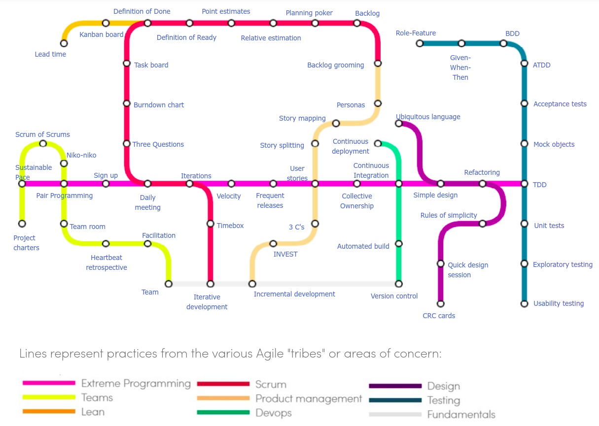

## Four Values of Agile Manifesto

Ref: [Agile Alliance](https://www.agilealliance.org/agile101/the-agile-manifesto/)

These values motivate the development process and practices.

1. **Individuals and Interactions Over Processes and Tools**
     * People respond to business needs and direct the development process

2. **Working Software Over Comprehensive Documentation**
     * "Just enough" documentation - the customer wants software, not lots of software docs.
     * If requirements are likely to change, writing up-front docs can be a waste.
     * This is not an excuse to _not_ write documentation.

3. **Customer Collaboration Over Contract Negotiation**

4. **Responding to Change Over Following a Plan**

## So What?

How does this apply to my software process?

## Twelve Agile Principles

[12 Principles](https://www.agilealliance.org/agile101/12-principles-behind-the-agile-manifesto/) at Agile Alliance.    
[12 Principles](https://www.smartsheet.com/comprehensive-guide-values-principles-agile-manifesto#the-twelve-agile-manifesto-principles) with commentary.    
[Nice interpretation of the 12 principles](http://www.consultparagon.com/blog/12-principles-of-agile-methodologies) at Paragon Consulting.    

1. *Satisfy the Customer* through early and frequent release of software. Collaboration and communication with Customer.
2. *Accommodate change*
   * Welcome changing requirements, even late in development.
   * Change means you are getting closer to client's true needs.
3. *Delivery frequently*
   * Didn't they already write this in #1?
4. *Collaborate between stakeholders and developers*
5. *Support, trust, and motivate the people involved*
6. *Enable face-to-face interactions* within team and between team-customer.
7. *Working software is the primary measure of progress*
8. *Maintain a Sustainable Pace* - be able to deliver quality iteration-after-iteration, project after project; maintain work/life balance.
   * P-PC Balance (Stephen Covey's Principle of Effectiveness).
   * Avoid overtime.
9. *Continuous Attention to Excellence* - attention to technical detail and design enhances agility, improves the product, enables change.
10. *Keep it Simple* – develop just enough for current goal.
   * "Maximizing the amount of work not done"
   * Not an excuse for bad design or poor code (principle 9)
11. *Self-Organizing Teams* encourage the best results.
   * Quality products come from skilled and motivated team members who have decision-making power, take ownership, communicate regularly, and share ideas.
12. *Regular Reflection* on how to become more effective.
   * (What are some actions that might come out of reflection?)

## Agile Practices

    

[Agile Practices Map](https://www.agilealliance.org/agile101/subway-map-to-agile-practices/) at [Agile Alliance](https://www.agilealliance.org/).

## Agile Practices You Can Use

* Test-Driven Development - write unit tests before writing the code
* Code Review - ask others to review and comment on your code.
* Pair Programming - one person codes while another navigates and reviews.
* Time-boxed iterations 
* Maintain a Sustainable Pace - do work early and regularly, not at the deadline
* Retrospectives - reflect on how to do better, and take action
* Continuous Integration - automate building and testing of your product, so it is tested each time you commit to Github.
    * Travis-CI, Circle CI, and Jenkins are tools for this
    * We will do this for your Django web app project
