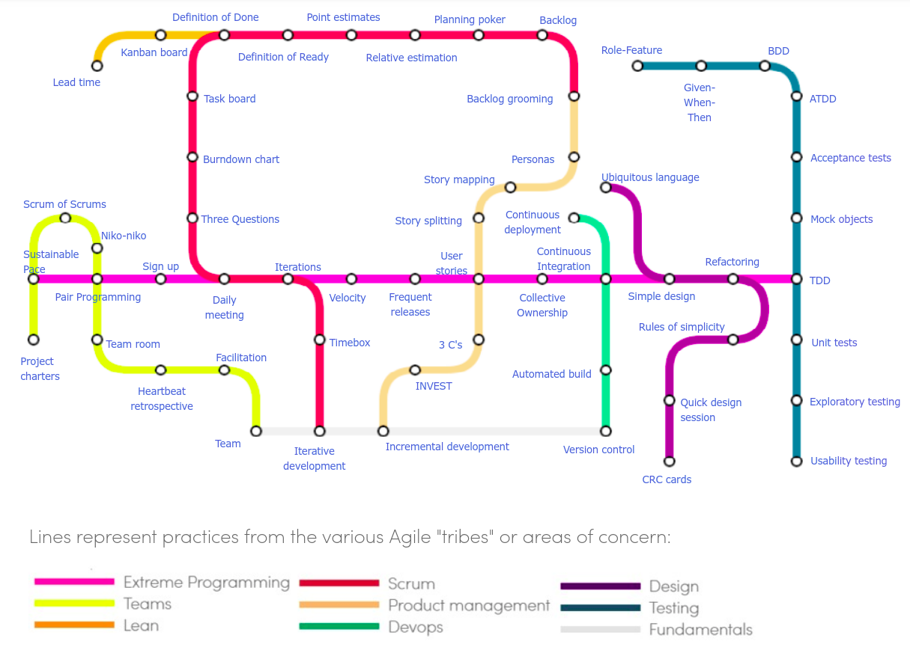

"Agile" is a set of values, principles, and a philosophy (or mind-set) about software development. 

Agile is *not* a software process -- Agile values and practices are used in many software processes.

* Agile created in reaction to perceived inefficiency of existing processes.
* Scrum and XP are development-focused processes based on Agile values.
* "Planned Based" or "Plan Driven" processes are considered non-agile, but this is not really true -- planned based projects can incorporate agile values.
  - Unified Process (UP) is main example.
  - Plan-based vs Agile process is a continuum of choices, not either-or.

The "*Agile Manifesto*" laid down the core values for agile software development.

These **values** motivate the development process and practices.

1. **Individuals and Interactions** over *Processes and Tools*
     * People respond to business needs and direct the development process

2. **Working Software** over *Comprehensive Documentation*
     * "Just enough" documentation - the customer wants software, not lots of software docs.
     * If requirements are likely to change, writing up-front docs can be a waste.
     * This is not an excuse to _not_ write documentation.

3. **Customer Collaboration** over *Contract Negotiation*

4. **Responding to Change** over *Following a Plan*

Ref: [Agile Alliance](https://www.agilealliance.org/agile101/the-agile-manifesto/)

Agile encourages frequent delivery of running software, customer collaboration,
face-to-face meetins, and self-managing teams.

## So What?

How does this apply to my software process?

## Twelve Agile Principles

[12 Principles](https://www.agilealliance.org/agile101/12-principles-behind-the-agile-manifesto/) at Agile Alliance.    
[Another version, with commentary](https://www.smartsheet.com/comprehensive-guide-values-principles-agile-manifesto#the-twelve-agile-manifesto-principles).    
[Nice interpretation of the 12 principles](http://www.consultparagon.com/blog/12-principles-of-agile-methodologies) at Paragon Consulting.    

1. *Satisfy the Customer* through early and frequent release of software. Collaboration and communication with Customer.
2. *Accommodate change*
   * Welcome changing requirements, even late in development.
   * Change means you are getting closer to client's true needs.
3. *Delivery frequently*
   * Didn't they already write this in #1?
4. *Collaborate between stakeholders and developers*
5. *Support, trust, and motivate the people involved*
6. *Enable face-to-face interactions* within team and between team-customer.
7. *Working software is the primary measure of progress*
8. *Maintain a Sustainable Pace* - be able to deliver quality iteration-after-iteration, project after project; maintain work/life balance.
   * P-PC Balance (Stephen Covey's Principle of Effectiveness).
   * Avoid overtime.
9. *Continuous Attention to Excellence* - attention to technical detail and design enhances agility, improves the product, enables change.
10. *Keep it Simple* – develop just enough for current goal.
   * "Maximizing the amount of work not done"
   * Not an excuse for bad design or poor code (principle 9)
11. *Self-Organizing Teams* encourage the best results.
   * Quality products come from skilled and motivated team members who have decision-making power, take ownership, communicate regularly, and share ideas.
12. *Regular Reflection* on how to become more effective.
   * (What are some actions that might come out of reflection?)

## Agile Practices

    

[Agile Practices Map](https://www.agilealliance.org/agile101/subway-map-to-agile-practices/) at [Agile Alliance](https://www.agilealliance.org/).

## Agile Practices You Can Use

* Test-Driven Development - write unit tests before writing the code
* Code Review - ask others to review and comment on your code.
* Pair Programming - one person codes while another navigates and reviews.
* Time-boxed iterations 
* Maintain a Sustainable Pace - do work early and regularly, not at the deadline
* [Retrospectives](#retrospectives) - reflect on how to do better, and take action
* Continuous Integration - automate building and testing of your product, so it is tested each time you commit to Github.
    * Travis-CI, Circle CI, and Jenkins are tools for this
    * We will do this for your Django web app project

## Story Map versus Task Board

A **Task Board** shows tasks for the current iteration and their status.
A task board can also be used for a release (shows release backlog).

A **Story Map** shows relationship between stories.

* stories that are "core" or "foundation" of the product.
* stories that build on other stories.
* stories ordered by release

## Burn down and Burn up charts

A **burn down** chart shows the remaining work versus time.
The y-axis (remaining work) is measured in hours or story points.

In a burn up chart, there is a top line for the total number of points (scope) of the iteration.  The line may change as: (a) work is added or removed (unplanned tasks), (b) tasks are re-estimated.

## Retrospectives

Purpose of retrospective is to improve the team's development process.

1. Set the stage - ensure everyone understands the goal and focus of retrospective. Give people a chance to talk at start of the meeting; so they will be more open later one.

2. Gather data - look at events of last sprint. Walk through work done and decisions made.  Get team to express view/feeling of the events.

3. Generate insights. Zero in on problematic events. Identify causes and try to trace them to "root" causes.

4. Decide what to do.  Create a plan for improvements or changes to make in the next sprint.

## Learn More 

* [Agile 101](https://www.agilealliance.org/agile101/) at Agile Alliance.    
* [Agile Product Ownership in a Nutshell](https://www.youtube.com/watch?v=502ILHjX9EE) (video)    
  - Think critically.  Do you agree with the workflow and principles? 
* *Practices Of An Agile Developer*, slides from the book: [PDF](PracticesOfAnAgileDeveloper-slides.pdf)
  - we will use parts of this book in this course
* Video: [Agile at Microsoft](https://www.youtube.com/watch?v=-LvCJpnNljU) about the Visual Studio Team Services transition to agile. Interesting, but some fuzzy use of buzzwords like "team owns X", "team is empowered to ...". 41 minutes.

## Agile Book

*Learning Agile* by Stellman & Greene (O'Reilly 2013). The authors have practiced, taught, and written about Agile for 20 years. Covers the same topics as *Head First Agile*.

*Head First Agile* by Stellman & Greene (2017) - very memorable explanation and examples of Agile practices and values; lots of review questions.  Has lots of PMI Exam practice questions. 490 pg (too) long.

*Agile Practice Guide* by AgileAlliance and PMI. Short, accurate guide to applying Agile. Appendix X3 is tool to assess how suitable Agile is to a project. (Similar to Barry Boehm's book *Balancing Agility and Discipline*.)
