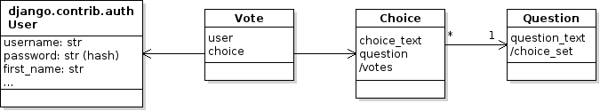

### Vote Class

We need to keep track of who has voted for which choice in which poll.
Conceptually, a User casts a Vote for a Choice in reponse to a Question:


A **software model** shows how we will implement the domain model in code. It involves some practical considerations:
- model classes are saved to a database, so replace a one-to-many relation with a many-to-one relation (reverse the association)
- a Choice knows which Question it refers to, so (maybe) we do not need a reference to Question in Vote. A vote can get the question using `self.choice.question`.
- avoid duplication. Don't maintain an explicit `votes` count in Choice.



`/votes` means that votes is a *computed attribute* rather than an actual attribute.  We count the votes whenever some code asks for it, instead of using a field.

`Vote` needs a reference to `user` and `choice`. These are ForeignKey attributes in the Vote model class.


### 1. Create a Vote Model

```python
# models.py
class Vote(models.Model):
    """Record a choice for a question made by a user."""
    user = models.ForeignKey(User, on_delete=models.CASCADE)
    choice = models.ForeignKey(Choice, on_delete=models.CASCADE)

    def __str__(self):
        # TODO
```

### 2. Modify the Choice Model

- remove the `votes` attribute
- define a `votes` property to count votes using a query expression


### 2.1 Write a `Choice.votes` property

```python
class Choice(models.Model):

   @property
   def votes(self):
      """Return the number of votes for this choice."""
      Todo: one statement to count the votes for this choice
      (at least 2 ways to do this)
```

### 3. Revise the `vote` view

The last thing we need to change in how the `vote` view works:

```
def vote(request, question_id):
    question = get_object_or_404(Question, id=question_id)
    user = request.user

    vote = get the previous vote on this question by this user
    if vote exists then
         update the user's choice
    else
         create a new vote
         record the user's choice
    save the vote
```

### 4. Test It

* Migrate the database.
* Run unit tests.
* Login and vote.


---

### Use Query Methods Instead of Python Code

Retrieving data from a database table and creating Python objects uses a lot of **time** and **memory**.

**Better**: let the database do the work. It is faster, uses less memory, and more efficient.
Use django query methods like `filter`, `count`, and `sum` use database operations instead of objects.

Example: count all the votes for a choice.   

**Wrong**: This is *inefficient*. If you do this on a quiz, you will get **zero credit** (maybe even negative points). 
```python
# INEFFICIENT: retrieves all vote data & create objects
#              Most of the data is never used.
count = 0
for vote in Vote.objects.all():
    if vote.choice == some_choice:
        count += 1
```

**Right**: Use a query to select the votes and count them.  This requires a single SQL expression.
```python
count = Vote.objects.filter(choice=some_choice).count()
```

You can **traverse the object graph** or invoke methods using double underscore (`__`) in place of `.`. 

Get all votes for `question1`:
```python
# this is like writing:
# [v for v in votes if v.choice.question == question1]
Vote.objects.filter(choice__question=question1)
```


## Resources

[Django Query Expressions](https://docs.djangoproject.com/en/4.2/ref/models/expressions/) have a much richer syntax than the expressions shown here.
