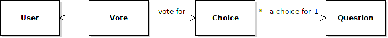

## New Features to Add in Iteration 3

- User accounts and ability for users to login and logout.
- A visitor must login in order to submit a vote or change his vote(s).
- An authenticated user is allowed only 1 vote per poll, but he can change his vote anytime while voting is allowed for a poll.
- A user can change his vote on a poll during the voting period, and his new vote replaces his old vote. 
- If a user selects a poll he already voted for, the list of choices shows which choice he/she previously selected. For example, a radio button is pre-selected for his previous vote.
- Add a link for "Login" or "Logout" to web pages.  It is good UI design if these links appear in the *same place* on all pages (e.g. a common header or sidebar).

Other Behavior:

- Anyone can view the list of polls and poll results (same as before)
- (Optional for now) Add logging of important events, such as login, logout, failed login, and submitting a vote.

## Requirements

Project Management Artifacts:

1. Create an Iteration 3 Plan in your wiki.
2. Review and update your Requirements document. 
3. Update the Development Plan for iteration 3.
4. Create an Iteration 3 Task Board and add tasks.
   - Also convert task to "Issues" so they appear in your repo on Github.

Software Process and Development:

1. Do work on an `iteration3` branch and push it to Github regularly.
2. Write unit tests to verify the new work is correct and satisfies requirements.
3. Add at least 2 demo users to your database.  In `README.md` add the username and password for these users.  This is so we can use your application.  For **example**
   ```
   | Username  | Password        |
   |-----------|-----------------|
   |   demo1   | stupidpassword1 |
   |   demo2   | stupidpassword2 |
   ```
4. **Data Fixtures** When you are done create new data import files for questions, polls, and users.
   ```
   cmd> python manage.py dumpdata --indent=2 -o data/polls.json polls 
   cmd> python manage.py dumpdata --indent=2 -o data/users.json auth.user
   ```


### Incremental Development

You should try to make small changes to the code and test each change
You want to maintain runnable code as much as possible.  

### Design Hints

You need to keep track of who has voted for which poll.
This requires a change in the domain model, as discussed in the lab.



`Vote` needs a reference to `user` and `choice`. These are ForeignKey attributes in the Vote model class.

After this change, there is no "votes" attribute in Choice.
But, our templates use `choice.votes` to display the votes. 

**Hide the change** by redefining `votes` as a read-only property
that counts the votes for a choice each time it is called.
The `votes` property "*looks*" like the old `votes` attribute,
so your templates and tests should still work!


### Use Query Methods Instead of Fetching All Votes

Retrieving all data from a table and creating Python objects is **inefficient**.
Try to write efficent code for summing the votes for a choice.

Use Django query methods like `filter`, `count`, and `sum`.
They generate code that uses database operations without creating lots of objects.  This is much more efficient and faster.

- *Inefficient*: get all the votes and sum the ones that match a choice. This requires getting all the data from the Vote table and creating Vote objects.
   ```python
   # INEFFICIENT: requires getting all the data and creating many objects
   count = 0
   for vote in Vote.objects.all():
       if vote.choice == some_choice:
           count += 1
   ```

- *Efficient*: Create a query to select the votes you want, and count them!  The work is done by the database without returning a lot of data or creating a lot of Vote objects. 
   ```python
   # count the votes for some_choice
   count = Vote.objects.filter(choice=some_choice).count()
   ```

### (Optional) Divide Tests into Separate Files

Your code now has many unit tests, so consider separating tests
into separate files, as recommended in the MDN Django Tutorial.

- Create a `polls/tests` directory with an `__init__.py` file.
- Divide your tests into separate files, with related tests in one file, such as:
  ```
  polls/tests/
             __init__.py
             test_index.py
             test_poll_dates.py
             test_auth.py
             test_voting.py
   ```
- Delete the original `tests.py` file
- Fix the imports in test files. Instead of `.models` use `polls.models`. Similarly for `.views`.


### (Optional) Logging

(Optional) Add logging of some important events:

| Event                      | Log Level |
|----------------------------|-----------|
| user login or logout       | info      |
| unsuccessful login attempt (username or password incorrect) | warning |
| user submits a vote        | info      |

- all log messages should include the date and time (that's done by the formatter, don't put it in your log message).
- login/logout messages should include the user's IP address
- log to the console, like Django does.
- use `loggers`, not print statements!

Django uses Python's logging library. 

You configure the logger behavior, including message format, in `settings.py`.

An example of using logging is:

```python
import logging
logger = logging.getLogger("polls") 

logger.info(f"{user} logged in from {ip_addr}")
logger.warn(f"Invalid login attempt for {username} from {ip_addr}")
logger.error("Caught unexpected exception: " + str(exception))
```

### Getting a Visitor's IP Address (for Logging)

When someone logs in you should include their IP address in the log message.

There are many posts showing how to write a `get_client_ip` 
function using the Django `request` object.
Getting the visitor's **actual** IP address is harder than it looks,
as commenters mention here:
<https://stackoverflow.com/questions/4581789/how-do-i-get-user-ip-address-in-django>

One implementation (copied from the Internet)
uses HttpRequest headers sent by the client, 
`HTTP_X_FORWARDED_FOR` and `REMOTE_ADDR`

```python
def get_client_ip(request):
    """Get the visitor’s IP address using request headers."""
    x_forwarded_for = request.META.get('HTTP_X_FORWARDED_FOR')
    if x_forwarded_for:
        ip = x_forwarded_for.split(',')[0]
    else:
        ip = request.META.get('REMOTE_ADDR')
    return ip
```
this is OK, but request headers can be manipulated by the sender.

## Documents that may help

- My page on Django Authentication: <https://cpske.github.io/ISP/django/authentication>
- MDN page on Django Authentication: <https://developer.mozilla.org/en-US/docs/Learn/Server-side/Django/Authentication>
- My page on Django Authorization: <https://cpske.github.io/ISP/django/authorization>
- Sample Unit Tests (may need editing): <https://cpske.github.io/ISP/assignment/ku-polls/user-auth-tests.py>
- Logging in Django: <https://docs.djangoproject.com/en/dev/howto/logging/>
