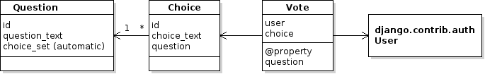

Add user authentication and allow each user only 1 vote per poll.

User authentication is done using boring old username-password 
authorization, which Django calls "ModelBackend".

Behavior to add or modify is:

- Only an authenticated user can submit a vote
- Anyone can view the list of polls or poll results (same as before)
- A user can change his vote on a poll during the voting period, and his new vote replaces his old vote. 
- A user can change his vote only during a poll's voting period.
- If a user selects a poll he already voted for, the list of choices shows which choice he/she previously selected. For example, a radio button is pre-selected for his previous vote.

- (Optional) Add logging of these events:

| Event                      | Log Level |
|----------------------------|-----------|
| user login or logout    -  | info      |
| unsuccessful login attempt (username or password incorrect) | warning |
| user submits a vote        | info      |

  - all log messages should include the date and time (that's done by the formatter, don't put it in your log message).
  - login/logout messages should include the user's IP address
  - log to the console, like Django does.
  - use `loggers`, not print statements!

## Requirements

1. Create an Iteration 3 Plan in your wiki.
2. Add Iteration 3 tasks to your Project. Create an "Iteration 3" task board with these tasks.
3. Write unit tests to verify this behavior.
4. Add at least 2 demo users to your database.  Document the login/password for these uses in README.md so we can run your app and submit votes.

The project now has many unit tests, so consider refactoring the 
tests as recommended in the MDN Django Tutorial.

- Create a `polls/tests` directory with an `__init__.py` file.
- Divide your tests into separate files, grouped however makes sense, such as:
  ```
  polls/tests/
             __init__.py
             test_index.py
             test_poll_dates.py
             test_auth.py
             test_voting.py
   ```
- Delete the original `tests.py` file


## Design Hints

You need to keep track of who has voted for which poll.
This requires a change in the domain model.



`Vote` needs a reference to `user` and `choice`. These should be ForeignKey attributes in the Vote model class.

After this change, there is no "votes" attribute in Choice.
But our code uses `choice.votes` to display the votes, and we would like to
avoid making a lot of changes to code.

To **hide the change** we can redefine `votes` as a read-only property.
The property computes and returns the votes for a choice each time it's called.

The `votes` property would "look" like the `votes` attribute in the old
code.

### Use the Database Capabilities instead of Fetching All Votes!

Try to write efficent code for summing the votes for a choice.

- *Inefficient*: get all the votes and sum the ones that match a choice. This requires getting all the data from the Vote table and creating Vote objects.
   ```python
   # INEFFICIENT: requires getting all the data and creating many objects
   count = 0
   for vote in Vote.objects.all():
       if vote.choice == some_choice:
           count += 1
   ```

- *Effcient*: Create a query to select the votes you want, and count them!  The work will be done by the database without creating a lot of Vote objects. 
   ```python
   # count the votes for some_choice
   count = Vote.objects.filter(choice=some_choice).count()
   ```

## Logging

Django uses Python's logging library. 

You configure the logger behavior, including message format, in `settings.py`.

An example of using logging is:

```python
import logging
logger = logging.getLogger("polls") 

logger.info(f"{user} logged in from {ip_addr}")
logger.warn(f"Invalid login attempt for {username} from {ip_addr}")
logger.error("Caught unexpected exception: " + str(exception))
```

## Getting a Visitor's IP Address

When someone logs in you should include their IP address in the log message.

There are many posts showing how to write a `get_client_ip` function using 
info in the Django `request` object.
Getting the visitor's **actual** IP address is harder than it looks,
as some commenters mention here:
https://stackoverflow.com/questions/4581789/how-do-i-get-user-ip-address-in-django

Try to choose a good implementation, but it doesn't have to be perfect.

One implementation (copied from the Internet)
uses HttpRequest headers sent by the client, `HTTP_X_FORWARDED_FOR` and `REMOTE_ADDR`

```python
def get_client_ip(request):
    """Get the visitor’s IP address using request headers."""
    x_forwarded_for = request.META.get('HTTP_X_FORWARDED_FOR')
    if x_forwarded_for:
        ip = x_forwarded_for.split(',')[0]
    else:
        ip = request.META.get('REMOTE_ADDR')
    return ip
```

## Documents that may help

- My page on Django Authentication: <https://cpske.github.io/ISP/django/authentication>
- MDN page on Django Authentication: <https://developer.mozilla.org/en-US/docs/Learn/Server-side/Django/Authentication>
- My page on Django Authorization: <https://cpske.github.io/ISP/django/authorization>
- Sample Unit Tests (may need editing): <https://cpske.github.io/ISP/assignment/ku-polls/user-auth-tests.py>
- Logging in Django: <https://docs.djangoproject.com/en/dev/howto/logging/>
