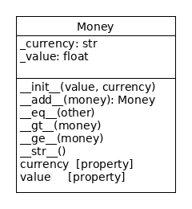

## Python Review (Done After the Github Warm-up)

1. Why use **properties** instead of just exposing an object's attributes?
   - What Object-oriented principle do properties use?
   - Code to expose attributes:
     ```python
     class Money:
         def __init__(self, value, currency):
             self.value = value
             self.currency = currency
     ```
   - Code to use properties in place of attributes: 
     ```python
     class Money:
         def __init__(self, value, currency):
             self._value = value
             self._currency = currency
    
       @property
       def value(self):
            return self._value
    ```

2. Using properties to control access to attributes is an example of what **fundamental principle of OOP**? (Name this principle.)

3. A Banknote is a special kind of money that has a serial number and limited set of values (e.g. 20, 50, 100, ...).  
   - Add a `Banknote` class to your money repository, but *do not* duplicate any code from Money.
   - The `Banknote` constructor automatically chooses a unique serial number, starting with 1,000,000,000. Hint: write a *class method for this* or *create a generator*.
   ```python
   class Banknote(???):
       """Paper money with a unique serial number."""

       # TODO write a constructor


       @classmethod
       def make_serial_number(cls):
           serial = Banknote.next_serial_number
           Banknote.next_serial_number += 1
           return serial
   ```

4. In OOP, one class can reuse the methods and attributes from another class, without duplicating the code.  What is the name of this **fundamental principle of OOP**?

5. How did you write the constructor for Banknote?
   - Wrong:
     ```python
     def __init__(self, amount, currency):
        self._amount = amount       // same as Money
        self._currecy = currency    // same as Money
        self._serial_number = Banknote.next_serial_number()
     ```
   - Right:
     ```python
     def __init__(self, amount, currency):
        // Let Money constructor manage its own attributes
        _______________________

        self._serial_number = Banknote.make_serial_number()
     ```

6. The software for a Store creates a `Bill` when a customer buys something.
   The amount on the Bill is "Money".
   - Should `Bill` be a subclass of Money?  Give a reason for your answer.

7.  What is another way to model the relationship between `Bill` and `Money`? (without using inheritance)
   - Draw a UML class diagram of your design.
   - OO Principle: *Prefer composition over inheritance.*    
   - This principle is from the original *Design Patterns* book.

8. How do you add *type hints* to the constructor to indicate that
   `value` should be `float` and `currency` should be `str`?
   ```python
   class Money:

       def __init__(self, amount           , currency):
          pass
   ```

9. Methods like `__eq__` and `__str__` are called **magic methods**.    
   Why?

10. We invoke `__eq__` by writing `a == b` where `a` and `b` refer to some object with an `__eq__` method.
    - How do we invoke `__str__`?

11. Suppose we want to be able to add Money objects like this:
    ```python
    m1 = Money(5, 'Baht')
    m2 = Money(20, 'Baht')
    sum = m1 + m2
    print(sum)
    25 Baht
    ```
    - What method should we write? 
    - What parameter(s) does this method need?

12. Write the code for the "add" method and test it on your computer. 
    1. in `money_test.py` there are 2 "skipped" tests for add.  Remove the `@pytest.mark.skip` annotation to use the tests.
    ```python
    # @pytest.mark.skip("skip this test until ...")
    def test_add():
        """Add money objects with the same currency."""
    ```
   - run pytest.  2 tests should **fail**.
   - write code for "add" method until the tests **pass**.

13. It does not make sense to add money with different currencies:
    ```python
    m1 = Money(10, 'Baht')
    m2 = Money(20, 'USD')
    m1 + m2
    THIS IS NONSENSE
    ```
    - What should we do if someone tries to add Money with different currencies?
    - What should we do if someone tries to add Money to something that is not Money (like a float or string)?
    - TODO: Modify your "add" method to raise exception if currencies are different.
    - TODO: Modify "add" to raise exception of the parameter is not an instance of Money. Use `isinstance(obj, Classname)` to test it.

14. Commit and push your work:
    - Commit changes with a **descriptive** git comment (-m)
    - Software Process: Always write a **descriptive** comment when you commit work, such as "*completed `__add__` method and unit tests*".
    - Push to Github

15. Go to Github and observe that it automatically runs your pytests.  The tests should all pass.

### Collections You Should Know

Names these collections and show how to use them.

1. An ordered collection of objects, which may contain duplicates.
   - you can add or remove items at any position
   - you can get any element using an index, e.g. `students[3]`
   - in Python, you can access a *range* of elements: `students[3:8]`

2. An unordered collection of objets, without duplicates.
   - you can add or remove elements, but cannot specify their location in the colection
   - to retrieve elements, use an iterator, e.g. `for x in collection`

3. A collection of key-value pairs.
   - add or replace pairs using: `foo[key] = value`
   - remove a key/value using: `del(foo[key])`    Python's *ugliest* syntax
   - iterate over keys:  `for x in foo`


### What to Submit

Push your revised `money.py` and `money_test.py` to Github.




### Magic Methods


| Method           | Description                   |
|:-----------------|:------------------------------|
| `__add__`   | "a + b", return the result as a new object. (3) |
| `__gt__`    | Test `self > other`. For Money, first compare currencies, then the value. |
| `__ge__`    | Test `self >= other`. True if `self > other` or `self == other`. |
| `__str__`   | Return string representation. |
| `__mul__`   | "a * b" (multiply), return result as a new object. `a * b` invokes `__mul__(a,b)`. |
| `__rmul__`  | Multiply 2 objects where "self" is on the right of multiply sign. `a * b` invokes `__mul__(b,a)` in the class of `b`. |


