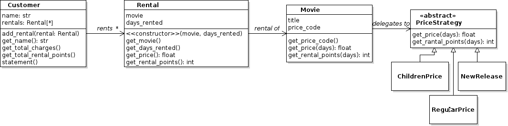
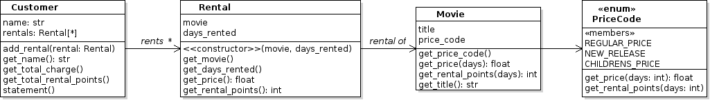

## Description

This is a well-known refactoring example from [Chapter 1][refactoring_pdf] of
_Refactoring: Improving the Design of Existing Code_ by Martin Fowler.  

The application creates a statement showing the movie rentals by a customer, along with the total price and "frequent renter points" earned.

In the application, a **Customer** rents **Movies**. A **Rental** object records the movie and `days_rented`.  The rental **price** of a Movie is based on its **price code** such as "New Release", "Children's Movie", or "Regular". The price code also determines the **frequent renter points** earned for a Rental.

The Customer class has a `statement` method that creates a formatted statement containing the details of each rental along with total amount and total points earned, and returns the statement as a string.

`main.py` creates a customer, rents some movies, and prints a statement.

## Assignment

This assignment a contains Python translation of the original Java version.

The [PDF from Chapter 1][refactoring_pdf] explains the 
motivation for each refactoring and how to do it.  Please read it.

### Changes in the Python Version

In Python, the refactoring are the same as Fowler's Java version, but some details are different.

- Variable names use the Python naming convention (`total_amount`) instead of Java camelcase names (`totalAmount`), and no leading underscore.
- Instead of `getCharge()` (Java) use `get_price`
- Instead of `getFrequentRenterPoints()` (Java) use `get_rental_points` ("rental" instead of "renter")
- Instead of `Price` for strategies (p. 29) use `PriceStrategy`


## Instructions

Before *and* after each refactoring you should **run the unit tests**.

Perform each of these refactorings:

1. *Extract Method for rental price calculation*.  In `Customer.statement()` extract the code that calculates the price of one rental.
   - Make it a separate method. Fowler calls it `amountFor` but a Pythonic name would be `amount_for` or `get_price(rental)`. 

2. *Move Method*. After extracting the method for price calculation (above),
observe that the method uses information about the rental but not about the customer.  Hence, the method should be in the `Rental` class instead of the `Customer` class. 
   - Move the method to the `Rental` class. 
   - The `rental` parameter is now `self`.
   - After moving the method, verify that the method is referenced correctly in code.  Customer should call `rental.amount_for()`.
    - write a unit test for this method in `rental_test.py`.

3. *Rename Method*. The method name `amount_for` or `amountFor` is no longer descriptive, so rename it. Fowler uses `getCharge` but "charge" could be confused with a credit card "charge". Use `get_price(self)` as the new name.
    - Verify that the method is renamed everywhere! 
    - Check it in Customer and `rental_test.py`.

4. *Replace Temp Variable with Query* (*aka* "Inline Temp").  In `statement()`, instead of assigning `charge = rental.get_price()` (Java: `charge = rental.getCharge()`) and then using `charge`, directly invoke `rental.get_price()` wherever it is needed ("Inline Temp"). 

5. *Extract Frequent Renter Points*. Repeat the steps you performed above for rental price to frequent renter points in `statement`. 
   - The calculation of renter points depends only on information in a Rental, so move this calculation to the Rental class. Name the new method `rental_points`.
   - In `customer.statement()` call this method.
   - Write a unit test in `rental_test.py` to verify your new method computes frequent renter points correctly.

6. *Extract Method to compute total charge*. Move the computation of *total aount* from `statement` to a separate method in `Customer`.  `statement` calls this method to get the total amount.
   - `statement` calls this method **only once** to get the total amount. Not inside a loop!
   - eliminate the temp variable `total_amount`.
   - write a unit test for this new method in `customer_test.py` to verify the total charge for a collection of rentals is correct.

7. *Extract Method to compute total rental points*. Instead of computing total rental points in `statement`, extract a method to compute and return it -- just like for total rental price (above).
   - eliminate the temp variable `frequent_renter_points` and instead call this method **one time**.
   - write a unit test for this new method in `customer_test.py` to verify the total renter points is computed correctly.

8. *Replace Conditional Logic with Polymorphism* (Fowler, p. 28).  In `Rental.get_price` (Java: `getCharge`) there is a long `if ... elif ... elif` to compute the rental price by testing the Movie price code. In the Java version, this is a `switch` statement.  Replace this with *polymorphism*.    
   Do this in **three steps**.
   - Step 1: make the Movie class compute its own rental price and rental points. Rental calls `movie.get_rental_points(days)` and `movie.get_price(days)`.
   - Step 2: *Replace Switch with Polymorphism* (Page 29). Replace price code constants with a hierarchy of `PriceStrategy` objects. Fowler calls the superclass `Price`. Since this is the *Strategy Pattern*, let's call it PriceStrategy. *See below for details*.
   - Step 3: Movie *delegates* the computation of rental price and rental points to the PriceStrategy object.
   - Replace the constants for price code with PriceStrategy objects.
   - In Fowler's article, this is a long refactoring because he first uses inheritance (Movie subclasses on page 28) and then explains why that's a poor solution.
   - This refactoring uses the principle "*Prefer composition over inheritance*".

*How to Implement Price Strategy*: In Python, there are two ways to define polymorphic price objects
- [Define a Price Strategy Hierarchy](#define-a-pricestrategy-class-hierarchy) as in the Java version.
- [Define an Enum for Price Strategy](#define-an-enum-for-pricestrategy) where each Enum member implements the strategy methods as lambdas.  This only works if the strategies are simple enough to be implemented as lambda expressions.


### Missing Refactorings?

In the final code, do you see anything that *still* needs refactoring, based on the refactoring signs ("code smells") or design principles?

Do you think any of the refactorings are wrong?

Share your ideas on Discord and we will discuss them after this assignment is finished.


### Define a PriceStrategy Class Hierarchy

In Java, to apply the Strategy Pattern you define an Interface for the strategy (`PriceStrategy`) and then define concrete implementations of the interface, such as RegularPrice, NewRelease, and ChildrensPrice.

Python does not require defining an interface for the strategy, but for clarity and type safety you can create an abstract base class (`PriceStrategy`) for the interface with abstract methods that subclasses must implement.  `RegularPrice`, `NewRelease`, etc., extend  `PriceStrategy` and implement the methods.

```python
from abc import ABC, abstractmethod

class PriceStrategy(ABC):
   """Abstract base class (interface) for rental pricing."""

    @abstractmethod
    def get_rental_points(self, days: int) -> int:
        """The frequent renter points earned for this rental."""
        pass

    @abstractmethod
    def get_price(self, days: int) -> float:
        """The price of this movie rental."""
        pass
```

Each concrete price strategy implements the abstract methods:
```python
class NewRelease(PriceStrategy):
    """Pricing rules for New Release movies."""

    def get_rental_points(self, days):
        """New release rentals get 1 point per day rented."""
        return days
    
    def get_price(self, days):
        #TODO return rental price for a new release
```

The strategy objects don't save any *state* so we can share one instance among many Movies.  In the file containing the strategies create one instance of each strategy and use it in place of the constants in Movie:
```python
"""price_strategy module."""
class PriceStrategy(ABC):
    ...

class NewRelease(PriceStrategy):
    ...

class RegularPrice(PriceStrategy):
    ...

# Predefined instances of the strategies used as constants
NEW_RELEASE = NewRelease()
REGULAR = RegularPrice()
CHILDREN = ChildrensPrice()
```
Python requires the instances be created *after* the class definition.


### Define an Enum for PriceStrategy

Another way to implement a Strategy in Python is to use an Enum. 
- The Enum defines the methods required by the strategy
- Each member of the enum is one concrete pricing strategy (regular, childrens', new release).
- Each enum member has a dict named `value`, that you define when you declare the enum member.  Here's a naive example of assigning fixed values for "price" and "frp" (frequent renter points):

```python
from enum import Enum

class PriceStrategy(Enum):
   # these are the members (instances) of the enum
   NEW_RELEASE = { "price": 3, "frp": 2 }
   REGULAR_PRICE = {"price": 2, "frp": 1 }

   def get_price(self, days):
      return self.value["price"]*days
   
   def get_rental_points(self, days):
      return self.value["frp"]
```

You can assign an Enum member to a variable, and then invoke its methods:

```python
>>> price_code = PriceStrategy.NEW_RELEASE
>>> print("Rental price for 4 days:", price_code.get_price(4))
Rental price for 4 days: 12
```

- You can assign functions to the enum values using lambdas.  Each enum member defines it's own lambda for pricing and frequent renter points.
This is more flexible than the naive approach above.

```python
from enum import Enum

class PriceStrategy(Enum):
    NEW_RELEASE = {"price": lambda days: 3.0*days, 
                    "frp": lambda days: days
                  }
    REGULAR_PRICE = { ... }
    ...

    def get_price(self, days: int) -> float:
        """Return rental price for a given number of days."""
        pricing = self.value["price"]  # a lambda
        return pricing(days)
```

Whether you use an Enum or an abstract base class with subclasses, the code for Movie will be similar. The important part is that Movie *delegates* computation of price and rental points to the PriceStrategy instead of using `if ... elif ... elif ...`. 

This is the refactoring "*Replace Switch with Polymorphism*", implemented using the *Strategy Pattern*.

### UML Class Diagram



If you use an *enum* the structure would be:




## Resources

* [Refactoring, First Example][refactoring_pdf] extract from Martin Fowler's *Refactoring* book. 
* [Refactoring slides from U. Colorado](https://www.cs.colorado.edu/~kena/classes/6448/s05/lectures/lecture19.pdf) step-by-step instructions for Java version of this example, including UML class diagrams of progress.

[refactoring_pdf]: https://cpske.github.io/ISP/refactoring/Refactoring-movierental.pdf
