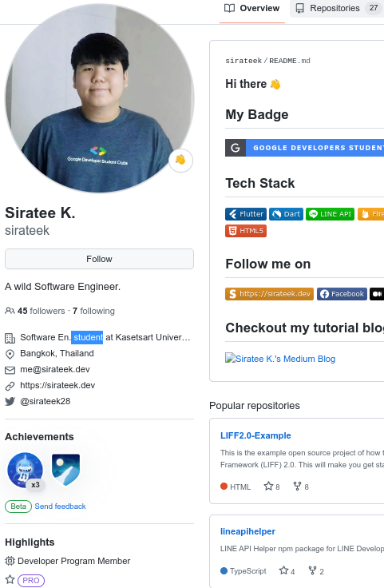

Please do this before the first week ISP lab:

1. Join the [Google Classroom][google-classroom-invite] for this course. Class code is **5zjkval**.
2. Tell us your Github id on this form: <https://forms.gle/QK36o6ky1D85KLsN7>
3. Update your Github Profile. Please include 
   - **photo** that clearly shows your face. Face should be at least 50% of vertical space.
   - your **real name** correctly **capitalized** ("Steve Jobs") -- first name only ("Steve") or first and last name ("Steve Jobs") are OK.  
   - Not a nickname; Not your Github login.
4. Join our [Discord Server][discord-invite].
5. Install this **required software**, if you don't have them:
   - **Git** including the `git` command. Download from <https://git-scm.com>
   - Python 3.9 or newer.
   - IDE for Python.  [PyCharm][], [PyDev][] (Eclipse), and [VS Code][vscode] are good.
   - [OBS Studio][obsproject], to record your computer screen during coding tests.
   - A good **text editor** with syntax highlighting, for situations where you want to edit a single text file.
     - Good editors: [Atom][], [Notepad++][] (Windows), [Sublime][], [VS Code][vscode] (a bit slow), [TextMate][] (Mac), or [vim][] (hard to learn).
     - Windows Notepad is NOT a good editor.

[Atom]: https://atom.io
[Notepad++]: https://notepad-plus-plus.org
[PyCharm]: https://www.jetbrains.com/pycharm/
[PyDev]: https://www.pydev.org/
[Sublime]: https://www.sublimetext.com/
[vscode]: https://code.visualstudio.com/
[TextMate]: https://macromates.com/
[nano]: https://www.nano-editor.org/
[vim]: https://www.vim.org/
[obsproject]: https://obsproject.com/

[google-classroom]: https://classroom.google.com/c/NjE0ODE4Mzg4ODEz
[google-classroom-invite]: https://classroom.google.com/c/NjE0ODE4Mzg4ODEz?cjc=5zjkval
[classroom-classwork]: https://classroom.google.com/w/NjE0ODE4Mzg4ODEz/t/all
[discord-invite]: https://discord.gg/gy2gbFNa

---

### Examples of Good Github Profiles

Your Github account is part of **your resume**.  Make it look professional!

&emsp;&emsp;

Note: you do not need to include your email in your profile, for privacy.

