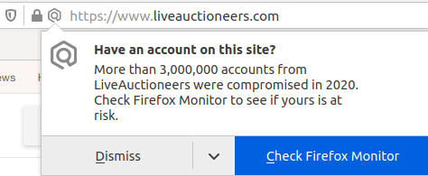

Presentation Slides: 
[Intro to Authentication & Authorization](Authentication-and-Authorization.pdf)

[Authentication in Django](/ISP/django/authentication)    
[Authorization in Django](/ISP/django/authorization)

## Authentication Methods

1. Username and password
   - passwords must be remembered and kept secret
   - **weak** since passwords can be stolen or guessed
   - servers should *never* store password as plain text or encrypted w/o salt
   - encrypted passwords (stolen from server) can still be cracked by brute force

2. Biometrics - body-based signature
   - fingerprint
   - iris scan
   - facial recognition
   - voice recognition
   - vein scan
   - only iris scan & vein scan are reasonably secure. Fingerprint, face, and voice are all hackable. 
   - recognition system uses "metrics" based on your fingerprint, face, voice, or iris and then matches them to later requests to authenticate. 
   - the match is only **approximate** (heuristic)!
   - Researchers have used 3D printing to copy a fingerprint from a photograph and use it to unlock phones. (Don't wave on Facebook!)
   - developer.scb - some old info about biometrics by Siam Commerical Bank

3. One-time Passwords
   - sent to your device by SMS, Line, etc.
   - OTP generator such as Google Auth (more secure than SMS)
   - a **list** of OTP that you print and save, *aka* "recovery passwords"

4. Certificate-based authentication (public-private key pair)

   - You create a public-private key pair for each server. Give the public key to the server.
   - private key is kept encrypted and confidential on your device. You "unlock
 the key with a password
   - to authenticate, a remote server sends a challenge. You use your private key to encrypt a response to the challenge
   - [Github SSH authentication](https://docs.github.com/en/authentication/connecting-to-github-with-ssh) uses this
   - [FIDO](https://fidoalliance.org/how-fido-works/) uses this. The link has a good explanatory with illustration!

5. USB Key or SmartCard - a private key(s) stored in a USB key or SmartCard.  
   - server sends a "challenge" that requires the private key to create a response

6. Token-based authentication (digital) or magnetic stripe card.
   - both involve a token that only you possess (hopefully!)
   - can be stolen or copied (forged)
   - what is a "*skimmer*"?

7. [SQRL][sqrl] novel protocol by Steve Gibson. 
   - Similar to certificate-base authentication, but private keys can be dynamically recreated from a single "master" key and the remote site's URL, so you don't need to store many private keys
   - "master" key is always stored encrypted and must be unlocks with a password before use
   - Open-source project
   - Video description [SQRL Explained](https://www.youtube.com/watch?v=-J10uh75slU)
   - [Specification & Explanation][sqrl] documents
   - Client apps for Android, iOS, Windows, MacOS, Linux, ... available
   - Server-side support for many frameworks

[sqrl]: https://www.grc.com/sqrl/sqrl.htm

## Multi-Factor Authentication

Use at least 2 of these:

* something you know
* something you have
* something you are

Class Exercise: 

* Give examples of each of the above

## Third-party Authentication 

Authenticate yourself using a trusted third party

- OAuth ([see below](#oauth))
- OpenID
- Many implementations vulnerable to "Covert Redirect" bug (2014) using XSS attack. Mostly fixed since then. 

## Single Sign-on 

Used on comporate networks (like KU) so a user authenticates once (to auth server) and can access many resources.  SSO uses a time-based token stored on user's device.
- Kerberos
- Microsoft Active Directory

**WSO2 Identity Server** - Single sign-on authentication server software,
provides server-side for OAuth, SAML, and single sign-on services.

WSO2 looks interesting. See: <https://is.docs.wso2.com/en/5.9.0/>

### Has Your Password Been Stolen?

* Check your email: [Have I Been Pwned?](https://haveibeenpwned.com/) <https://haveibeenpwned.com/>
* Check your password: [Pwned Passwords](https://haveibeenpwned.com/Passwords) - check a password.  
  - This page does **not** send your password over the Internet! 
  - Only a **partial hash** is sent; everything else is done in the browser.
* [Firefox Monitor](https://monitor.firefox.com/) similar to "Have I Been Pwned?".
* [Firefox Breach Monitoring](https://monitor.firefox.com/breaches) when you visit a site using Firefox, it warns you if this site has been compromised in the last 3 years -- so you can protect yourself.
  - Available in Firefox: Menu -> "Protections Dashboard"

Example of a Firefox breach alert when user visits a compromised site:    

## OAuth

[OAuth][oauth.com] is a standards-based 3rd party-based authentication and access protocol.

When you see "Login with Google" or "Login with Facebook" - those links use OAuth to verify identity and grant access to resources you own.

The original OAuth was to enable a 3rd party app to access a protected resource on a server; for example: give some app access to your contacts on Gmail.

A natural extension of this is to assert your identity.  By granting the 3rd party app access to *anything*, you are proving your identity on the OAuth server (e.g. Google).  
Often, the 3rd party app requests access to your real name and login or e-mail on the OAuth server.

OAuth2 (the current version) has different **flows** for different use cases, called **grant types**.

As a programmer, when you apply for access to an OAuth server (like Google) 
it's important that you choose the correct flow (grant type)!

Grant Type or Flow:

1. [Server-Side Web Applications](https://www.oauth.com/oauth2-servers/server-side-apps/) (like Django):
   - choose **Web Server Flow** or **Authorization Code** grant
   - when you register your web app with the OAuth service, the OAuth service gives you a "client id" and "client secret"
   - your web app uses the "client id" and "client secret" whenever it requests access to a user's data
   - your web app must protect the "client secret"!
   - good sequence diagram: [Auth Code Grant](https://op-developer.fi/p/authcodegrant)

2. [OAuth for Mobile Apps](https://www.oauth.com/oauth2-servers/mobile-and-native-apps/):
   - choose **Authorization Flow**
   - mobile apps cannot keep secret information, so there is not "client secret" and some restrictions on use
   - description and diagram: [Mobile App Dev with OAuth 2](https://www.ateam-oracle.com/oauth-2-0-authorization-code-flow-for-mobile-apps) some parts are specific to Oracle

3. [Browser-based Apps and "Single Page" Apps](https://www.oauth.com/oauth2-servers/single-page-apps/) 
   - run entirely in the web browser using Javascript or Web Assembly
   - browser-based apps cannot keep secrets, so there is not "client secret". Instead, a dynamically generated secret is sent with each request to prevent replay attacks.

[oauth.com]: https://www.oauth.com

### OAuth Resources

- [OAuth.com][oauth.com] - good intro to everything. The official OAuth site.
- [OAuth2.net](https://oauth.net/2/) - good info but some overly complex explanations
- [เรียนรู้เทคโนโลยี OAuth2](https://sysadmin.psu.ac.th/2019/03/03/what-is-oauth2/) from Songkhla University.

**Not** Recommended:

- [OAuth2 Simplified](https://oauth2simplified.com/) deceptively tries to collect e-mail addresses. The e-book is *not* free! He just wants your email.

### Details of how to use OAuth on Google

A downside of Google's OAuth is that they require you to install Google-specific packages.  (Since OAuth is a standard, this should *not* be necessary.)

* [Using OAuth 2.0 for Web Server Applications](https://developers.google.com/identity/protocols/oauth2/web-server) for web apps where the OAuth request is made from the server-side (back-end). 
* [Using OAuth 2.0 to Access Google APIs](https://developers.google.com/identity/protocols/oauth2)

## OpenID

[OpenID](https://openid.net/) and OpenID Connect provide assertion of identity. After authenticating to an OpenID service, you can use your identity to connect to other services or sites that are allowed to use that OpenID service.  A form of "single sign-on".

## Secure Quick Reliable Login (SQRL)

[SQRL][sqrl] is a new authentication protocol and software that eliminates the need for any secret data on the server side. Plus, the client needs to remember **only one** "master key". The per-site private keys are regenerated from the "master key" when they are needed.

SQRL generates all public-private keys from the user's single "master key" plus the site's URL using Elliptic Curve public-private keys.

- the client does not need to save the private keys for each site; it only needs to save the master key (in encrypted form)
- you can save your "identity" or "master key" on multiple devices -- no need to synchronize data each time you add a new site 
- web sites you visit only store your public key, so there are no "secrets" to be leaked by a data breach. As Gibson writes: "*SQRL gives the server no secrets to keep*".

When a user visits a site, the site displays a QR code containing the site URL and a challenge (a nonce). The SQRL client captures the QR code, regenerates the private key for that site, and uses it to send an encrypted response to the challenge.  The response can be sent via the web page (same channel) or from a mobile phone using a separate channel (out of band).

- [SQRL on grc.com][sqrl] has description of SQRL, details of the protocol, and links to both client and server-side implementations.
- SQRL mobile clients for Android and iOS are available.
- SQRL has extensions and add-ons for Drupal

[sqrl]: https://www.grc.com/sqrl/sqrl.htm

