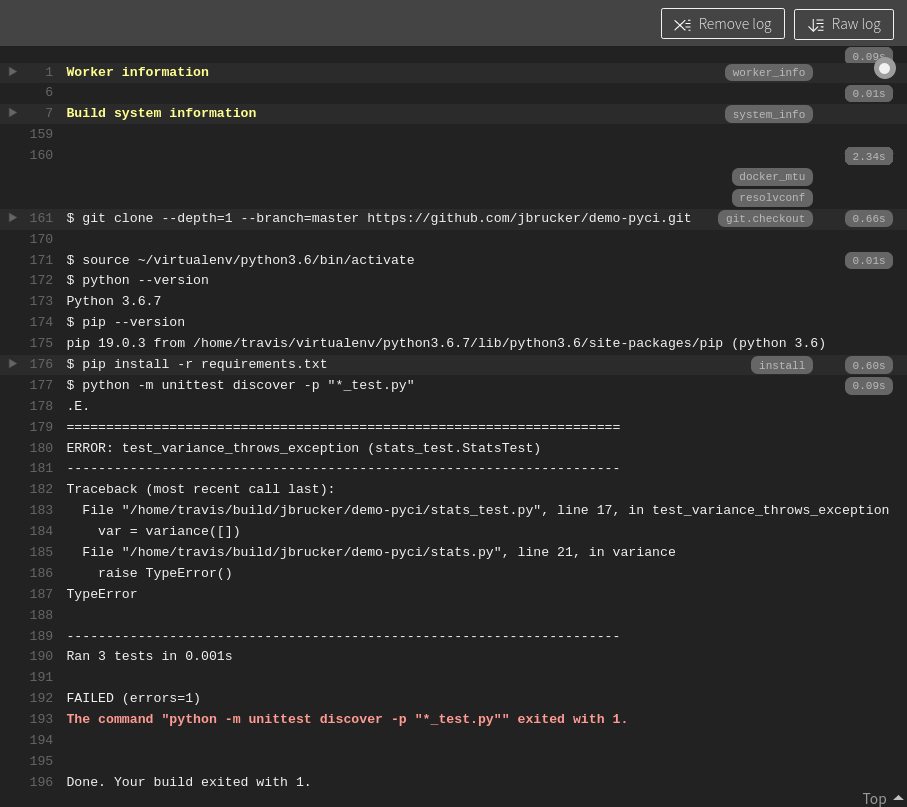

This project demonstrates use of Continuous Integration (CI) to build and test a Python project. 
Some CI services you can use are Github Actions, Circle-CI, and Travis-CI.
Travis-CI is no longer free, except for a trial period. Github is the simplest choice for Github projects.

To use any CI service, you create a "script" of instructions for the CI server.  You also define the "events" which should cause the script to execute, such as every time a commit is made on the master branch.

Finally, you need to give the CI server access to your repository and define a "hook" to notify the CI server when an event occurs (such as a commit).  If using Github Actions, this step isn't needed.

What you will do is:

* Create a git repository containing some code and tests
* Run the tests. Some test will fail. That's OK (don't fix it).
* Create a Github repo and push your local repo to Github
* Create a Github Action to run flake8 and unit tests
* View the build results and fix problems
* Add a Github "Badge" to your project README.md


### Create & Run a Github Action for a Sample Code (demo-pyci)

1. Download  the `demo-pyci.zip` using a link on the Google Classroom coursework page.

2. Create your own Python project using the ZIP file.

   - Change to a directory where you store projects (**not** inside another git repo) and unpack the zip file.  
   - Unzip will create a `demo-pyci` directory containing these files:
    ```
    demo-pyci/
        README.md
        statistics.py
        test_statistics.py
    ```
    **INCORRECT:** Your repo should **not** have an extra layer of directories.    
    This is **wrong**:
    ```
    demo-pyci/
        demo-pyci/
            README.md
            ...
    ```

3. Run the unit tests locally. One test should fail.
   - This is expected.
   - Please **do not fix the defect**.  We want to see if Github reports it.

4. In the `demo-pyci` directory do this:
   - create a git repository
   - add a .gitignore file for Python projects.  By now, you probably have your own .gitignore for Python projects. Your .gitignore should include `__pycache__` and `.coverage`.
   - add all files to the git repository, including .gitignore
   - commit everything to your git repo

5. Create a public `demo-pyci` repository on Github. **Push** your local git repo to Github.

6. **Add a Github Action**:  On Github, select the **Actions** tab.  Read the suggested choices for actions.

7. Select the "**Python Application**" Action, and click "Configure".

8. The "Configure" dialog lets you edit a `.yml` configuration file.
   - make some changes, such as change Python 3.10 to 3.9
   - change the action name (this name is shown on the "badge" so it should be descriptive)
     ```
     name: Unit Tests
     ```
   - don't install pytest (pip install pytest) since the tests use unittest
   - Change the unit test command from "pytest" to unittest:

     ```
     - name: Test with unittest
       run:  |
          python -m unittest
     ```

9. Write a commit message and commit these changes to the `.yml` file.

10. Wait a few seconds for the Action to run and look at the results.  (You did this in Programming 2.)
    - It should show that flake8 failed due a missing import of `sqrt`.

11. In your local repo, "pull" changes from Github in order to get the `.github` directory containing your Action script.
    - if you don't do this, you won't be able to "push" any work to Github because the Github repo is "ahead" of your local repo by 1 commit.
    - instead of "pull" you can use "fetch" and "merge".  There should not be any conflicts.

12. Fix the code:  add the missing import to `statistics.py`.
    ```python
    from math import sqrt
    ```
    - commit the fix and push to Github

13. Watch Github re-run your Action.

14. **Add a Github Badge to README.md**.
    - See <https://docs.github.com/en/actions/monitoring-and-troubleshooting-workflows/adding-a-workflow-status-badge>
    - In README.md, use Markdown for adding an image:
      ```markdown
      
      ```
    - Badges are added **after** the header line and before the first paragraph.
    - You can use any descriptive text instead of "Unittest Workflow".

## Add Code Coverage and Codecov.io

[Codecov.io](https://codecov.io) provides useful online visualization and detailed reports of test code coverage.  It uses data from the Python `coverage` command (same command you run on your own computer).

The idea is this:

1. Create an account on Codecov.io using your Github login for authentication
2. Configure Codecov to access your Github repository. This involves granting Codecov.io some permissions.
3. Define a Github Action to run `coverage` and then upload the report to Codecov.io.  Either:
  - create a new Github Action ([Instructions on Codecov][codecov-github-action]), or
  - add steps to an existing Github Action.  Since you already run tests in a Github Action, this is easiest and efficient.

Suppose you choose to add coverage to the Github Action you already have. You need to make a few changes to the `.yml` file for that Action:

- install the `coverage` package using `pip`
- in your "Run tests" step, change `python -m unittest` to `coverage run -m unittest`
- create an XML report for Codecov.io by adding a `coverage xml` command **after** run unit tests with coverage
```
      coverage run -m unittest
      coverage xml
```
- add a new step (see [Codecov Github Actions][codecov-github-action]) to upload the report a Github predefined action (no need to download the "codecov" uploader using curl):

```
    - name: Upload coverage report using Github Action
      uses: codecov/codecov-action@v3
```

Codecov.io has details of using a [Github Action][codecov-github-action]

[codecov-github-action]: https://docs.codecov.com/docs/github-2-getting-a-codecov-account-and-uploading-coverage#github-actions

### Get a Codecov "Badge" for README.md

On Codecov.io, navigate to your repository and click the "Settings" tab. 

In the "Badges & Graphs" section it has Markdown code you can add to README.md.

As usual, you should put this badge on a line **after** the title line in README.

---

## (Not Done in 2022) Using Travis-CI for Automatic Testing

[Travis-CI](https://travis-ci.com) is a continuous integration server for building, testing, and deploying software projects.  It works with many lanaguages and integrates easily with Github.

1. Create a Travis account on [Travis-ci.com](https://travis-ci.com) using Github for authentication.
   - When you connect your Travis account to Github, a dialog will ask which Github projects you want to allow Travis to access.
   - You can grant access to specific projects or all projects. The next step shows how to grant access to a project at any time.

2. On Github, open your **Account Settings** page, then:
    - select **Applications** from left (near bottom)
    - Next to "Travis CI" click **Configure** 
    - Under `(x) Only select repositories` Select `demo-pyci`
    - Click "Save"

3. (Alternate Way) On Travis-CI open "Setting".  In setting it shows your repositories.  There is a link "Manage repositories on Github".  This link takes you to the Github Account Settings -> Applications -> Travis CI dialog.  
   - choose which projects to grant Travis access, as in step 2.


Now Travis has permission to "pull" your `demo-pyci` project, but you must create a configuration file to tell Travis what to do!


## Create a Travis Configuration File (.travis.yml)

Many applications use YAML file format for configuration, including Travis and Github Actions. The Travis CI web site has many example config files you can use to get started, and detailed explanation of what the settings mean.

In your local repository, create a file named `.travis.yml` that describes your 
project.  Here is a simple `.travis.yml` for this project:

```
language: python

# you can use a different version of Python 
python: "3.6"

# don't clone more than necessary
git:
  depth: 1

# Install dependencies
install:
  - pip install -r requirements.txt
    
# script to run tests. Script can have many commands, one per line.
script: 
  - python -m unittest discover -p "*_test.py"
```

In this file, the indentation must be **spaces**, not tab. You should consistently use at least 2 spaces per indent level.  Just like Python, yaml requires consistent indentation.

1. Add the `.travis.yml` file to your local git repo and push to Github.

2. Go to <https://travis-ci.com/your_githubid/demo-pyci>  

3. Travis should automatically pull your code and start "building" your project
   - If Travis doesn't do this automatically, click a button at right to force a new build.


## Become Familiar with the Travis Web Interface

Look at all the steps Travis is performing. Can you tell what it's doing?

Your Travis home pages shows    

Left Side:
* your repositories that Travis is monitoring
* status of recent "builds"

Right Side (details for one repo selected on left side):
* Current build and screen showing console log
* Branches that Travis is monitoring and building (if any)
* History
* Pull Requests - Travis knows about Pull Requests!

Your **Job Log** screen will look something like this:


The "Build System Information" section of the log output is collapsed.    
Expand it and see how much work Travis is doing for you!

### Travis runs Python apps in a Virtual Environment

The "Build system information" section of Travis Job Log
shows that Travis uses a "virtualenv" to run Python projects,
and uses `pip` and `requirements.txt` to add required packages.
You will use this when testing and deploying your Django project(s).

Our `.travis.yml` file did not specify what virtual environment to use
(except the Python version) so Travis used the defaults, which is a Linux
virtual machine with common packages installed.

## Adding a Badge to your Project README.md

Add a Travis status notification at the top of your README.md file, called a "badge".  It looks like this:    
[](https://travis-ci.com/jbrucker/demo-pyci)

**Note:** Get the **actual URL** for your badge by clicking on the badge shown on **Travis CI**. The URL is shown under "Result".


Example: The Markdown for this is:
```markdown
[](https://app.travis-ci.com/your_acctid/demo-pyci)
[](https://app.travis-ci.com/borrabeam/demo-pyci)
```
> Don't rely on this example! Get the actual URL by clicking on the badge shown on the Travis build page for your repo.


## Fix the Bug and Watch Travis Rebuild your Project

1. Fix the bug in `stats.py`.  It should throw a `ValueError` when the list is empty. 
2. Run the tests locally. They should all pass.
3. Commit and push your fix.
4. Visit your Travis-CI page again.  It may take a minute or two to pull the new code, but you should see it rebuild the project and everything passes.
5. Visit (or refresh) your project on Github.  Does the "badge" show the tests are passing?

## Add Code Coverage and the Codecov Site

**Codecov** is a web app that graphically shows code coverage reports.

It's easy to use.

1. Go to https://codecov.io
2. Sign up using your Github ID
3. Click the "**Choose your first repository**" button and give Codecov access to your `demo-pyci` repository.
   - if you have used Codecov before, then add your `demo-pyci` repo.

Codecov shows some instructions including a Token. *You don't need the Token* for use with Travis-CI.

## Add Coverage to your .travis.yml file

Tell travis to run code coverage along with the unit tests, and send the report to Codecov.io.

1. Edit `requirements.txt` and add the `coverage` package:
   
   ```yaml
   # required packages
   coverage
   ```
   (or, you could add a `- pip install coverage` command in .travis.yml under the "install" section)
2. Modify the `script` section in `.travis.ci` to run "coverage" instead of "python":
   
   ```yaml
   script:
     - coverage run -m unittest discover -p "*_test.py"
   ```
3. Add a section to send the result to Codecov
   
   ```yaml
   after_script:
     - bash <(curl -s https://codecov.io/bash)
   ```
   The "curl" command gets a Bash script form codecov.io, then `bash <` feeds the script to Bash to execute the commands. (Don't do this with a site you don't trust.)
4. Commit these changes and push to Github.
5. After a few seconds, Travis should rebuild your project.

Note: This script uses `after_script` so that coverage is always run.
Many sample Travis build scripts use `after_succcess` instead of `after_script`.
      
## View your Coverage Report. Add a Badge to README.md

1. View the report at codecov.io.  It may take a few seconds after Travis finishes.

2. Get a Codecov "badge" and add to your README.md file.  


---

## Questions

1. On Github there is repo with name https://github.com/fatalaijon/tictactoe.
What **should be the URL** for this project on Travis-CI?

2. A CI service like Travis-CI helps you achieve which of the Tips in *Practices of an Agile Developer*?  There may be more than one.

------
### Required Reading

Read these short articles.  The content may be asked on a quiz.

* [Travis-CI Getting Started Guide][travis-ci-tutorial] short instructions how to get started.
* [Core CI Concepts for Beginners][travis-ci-concepts] - you can study this later, but you **must** read it
* [Building a Python Project][travis-ci-python] with Travis CI. Has many example scripts for Python projects.

### Travis CI Lifecycle

* https://docs.travis-ci.com/user/job-lifecycle/ - lists all the "phases" you can specify in a .travis-ci.yml file

### Useful to Know Later

* Travis-CI [Language-specific Guides][travis-ci-docs] at bottom of this page has additional info for [Python][travis-ci-python]
* [Beginner's Guide to using Codecov with Travis CI](https://medium.com/datadriveninvestor/beginners-guide-to-using-codecov-with-python-and-travis-ci-c17659bb711), but his example configuration is incomplete

### Travis for Makers 

Travis can "build" and test projects using the venerable (ancient) GNU Make utility.

Make is a build system configured using a `Makefile` that defines relationships between targets and dependencies, along with commands to run. 
You can use "make" to build almost any kind of project.  Make is used to compile the Linux operating sytem, C projects like MySQL (from source code), and books written using LaTeX.

There is an introduction to Make on the ISP course page.

To use "make" in your project, in `.travis.yml` write:
```
script:
  - make test
```
you must provide a [Makefile](Makefile) with a `test` target that runs your tests.

There's really no benefit to using Make for Python, unless you really love make.


[travis-ci-docs]: https://docs.travis-ci.com/
[travis-ci-tutorial]: https://docs.travis-ci.com/user/tutorial/
[travis-ci-concepts]: https://docs.travis-ci.com/user/for-beginners/
[travis-ci-python]: https://docs.travis-ci.com/user/languages/python/
