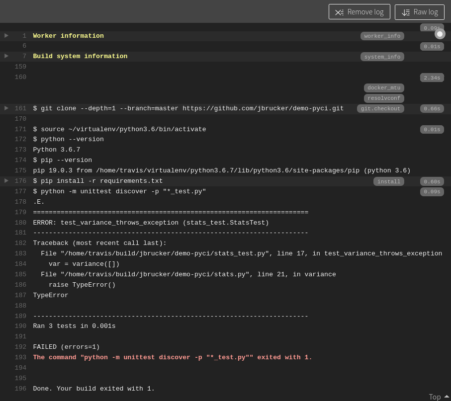

This project demonstrates use of Travis CI to build and test a Python project. 
You will create a repository on Github, then have Travis-CI pull and test it,
according to a "script" of instructions.

What you will do is:

* Create a git repository containing some code and tests
* Create a Github repo and push your local repo to Github
* Run the tests. Some test will fail. That's OK (don't fix it).
* Create a Travis-CI account and give Travis access to this project (repo).
* Create a Travis config file for your project and push it to Github
* Watch Travis test your code every time you change it and push to Github

Travis is a *Continuous Integration* service that *automatically* builds and tests your project whenever changes are committed to the source repository.

### Setup a Local Repository and Github Repo Containing Sample Code 

1. Download `demo-pyci.zip` via [this link](demo-pyci.zip) or link on Google Classroom coursework page.

2. Create your own Python project using the ZIP file.
   - Change to a directory where you store projects (**not** inside another git repo) and unpack the zip file.  
   - Unzip will create a `demo-pyci` directory containing these files:
    ```
    demo-pyci/
        README.md
        requirements.txt    (contains only a comment line)
        stats.py
        stats_test.py
    ```
    **INCORRECT:** Your repo should **not** have an extra layer of directories.    
    This is wrong:
    ```
    demo-pyci/
        demo-pyci/
            README.md
            ...
    ```
  
3. Change directory to `demo-pyci` and do this:
   - create a git repository
   - add a .gitignore file for Python projects.  By now, you should have your own .gitignore for Python projects. Your .gitignore should include `__pycache__` dirs.
   - add all files to the git repository, including .gitignore
   - commit everything to your git repo

4. Create a public `demo-pyci` repository on Github. Then
   - add it as remote for your local demo-pyci repo (`git remote add origin https://...`)
   - push everything to Github (`git push -u origin master`)

## Run the Tests Locally - One test should FAIL

Run the tests yourself to verify the code (almost) works.
We will then "script" this command for Travis to run for us.

Run the unit tests using test auto-discovery using command:
```bash
  python -m unittest discover -p "*_test.py"
```
The `-p "*_test.py"` option defines a **pattern** for autodiscovery of test files,
since the test filename ends with `_test.py`.

Runs 3 tests and one test fails.  

**Do not fix the error.**  We want a failure so you can see how Travis notifies you.

## Add Travis-CI for Automatic Testing

[Travis-CI](https://travis-ci.com) is a continuous integration server for building, testing, and deploying software projects.  It works with many lanaguages and integrates easily with Github.

1. Create a Travis account on [Travis-ci.com](https://travis-ci.com) using Github for authentication.
   - When you connect your Travis account to Github, a dialog will ask which Github projects you want to allow Travis to access.
   - You can grant access to specific projects or all projects. The next step shows how to grant access to a project at any time.

2. On Github, open your **Account Settings** page, then:
    - select **Applications** from left (near bottom)
    - Next to "Travis CI" click **Configure** 
    - Under `(x) Only select repositories` Select `demo-pyci`
    - Click "Save"

3. (Alternate Way) On Travis-CI open "Setting".  In setting it shows your repositories.  There is a link "Manage repositories on Github".  This link takes you to the Github Account Settings -> Applications -> Travis CI dialog.  
   - choose which projects to grant Travis access, as in step 2.


Now Travis has permission to "pull" your `demo-pyci` project, but you must create a configuration file to tell Travis what to do!


## Create a Travis Configuration File (.travis.yml)

Many applications use YAML file format for configuration, including Travis and Github Actions. The Travis CI web site has many example config files you can use to get started, and detailed explanation of what the settings mean.

In your local repository, create a file named `.travis.yml` that describes your 
project.  Here is a simple `.travis.yml` for this project:

```yml
language: python

# you can use a different version of Python 
python: "3.6"

# don't clone more than necessary
git:
  depth: 1

# Install dependencies
install:
  - pip install -r requirements.txt
    
# script to run tests. Script can have many commands, one per line.
script: 
  - python -m unittest discover -p "*_test.py"
```

In this file, the indentation must be **spaces**, not tab. You should consistently use at least 2 spaces per indent level.  Just like Python, yaml requires consistent indentation.

1. Add the `.travis.yml` file to your local git repo and push to Github.

2. Go to <https://travis-ci.com/your_githubid/demo-pyci>  

3. Travis should automatically pull your code and start "building" your project
   - If Travis doesn't do this automatically, click a button at right to force a new build.


## Become Familiar with the Travis Web Interface

Look at all the steps Travis is performing. Can you tell what it's doing?

Your Travis home pages shows    

Left Side:
* your repositories that Travis is monitoring
* status of recent "builds"

Right Side (details for one repo selected on left side):
* Current build and screen showing console log
* Branches that Travis is monitoring and building (if any)
* History
* Pull Requests - Travis knows about Pull Requests!

Your **Job Log** screen will look something like this:


The "Build System Information" section of the log output is collapsed.    
Expand it and see how much work Travis is doing for you!

### Travis runs Python apps in a Virtual Environment

The "Build system information" section of Travis Job Log
shows that Travis uses a "virtualenv" to run Python projects,
and uses `pip` and `requirements.txt` to add required packages.
You will use this when testing and deploying your Django project(s).

Our `.travis.yml` file did not specify what virtual environment to use
(except the Python version) so Travis used the defaults, which is a Linux
virtual machine with common packages installed.

## Adding a Badge to your Project README.md

Add a Travis status notification at the top of your README.md file, called a "badge".  It looks like this:    
[](https://travis-ci.com/jbrucker/demo-pyci)

**Note:** Get the **actual URL** for your badge by clicking on the badge shown on **Travis CI**. The URL is shown under "Result".


Example: The Markdown for this is:
```markdown
[](https://app.travis-ci.com/your_acctid/demo-pyci)
[](https://app.travis-ci.com/borrabeam/demo-pyci)
```
> Don't rely on this example! Get the actual URL by clicking on the badge shown on the Travis build page for your repo.


## Fix the Bug and Watch Travis Rebuild your Project

1. Fix the bug in `stats.py`.  It should throw a `ValueError` when the list is empty. 
2. Run the tests locally. They should all pass.
3. Commit and push your fix.
4. Visit your Travis-CI page again.  It may take a minute or two to pull the new code, but you should see it rebuild the project and everything passes.
5. Visit (or refresh) your project on Github.  Does the "badge" show the tests are passing?

## Add Code Coverage and the Codecov Site

**Codecov** is a web app that graphically shows code coverage reports.

It's easy to use.

1. Go to https://codecov.io
2. Sign up using your Github ID
3. Click the "**Choose your first repository**" button and give Codecov access to your `demo-pyci` repository.
   - if you have used Codecov before, then add your `demo-pyci` repo.

Codecov shows some instructions including a Token. *You don't need the Token* for use with Travis-CI.

## Add Coverage to your .travis.yml file

Tell travis to run code coverage along with the unit tests, and send the report to Codecov.io.

1. Edit `requirements.txt` and add the `coverage` package:
   
   ```yaml
   # required packages
   coverage
   ```
   (or, you could add a `- pip install coverage` command in .travis.yml under the "install" section)
2. Modify the `script` section in `.travis.ci` to run "coverage" instead of "python":
   
   ```yaml
   script:
     - coverage run -m unittest discover -p "*_test.py"
   ```
3. Add a section to send the result to Codecov
   
   ```yaml
   after_script:
     - bash <(curl -s https://codecov.io/bash)
   ```
   The "curl" command gets a Bash script form codecov.io, then `bash <` feeds the script to Bash to execute the commands. (Don't do this with a site you don't trust.)
4. Commit these changes and push to Github.
5. After a few seconds, Travis should rebuild your project.

Note: This script uses `after_script` so that coverage is always run.
Many sample Travis build scripts use `after_succcess` instead of `after_script`.
      
## View your Coverage Report. Add a Badge to README.md

1. View the report at codecov.io.  It may take a few seconds after Travis finishes.

2. Get a Codecov "badge" and add to your README.md file.  


---

## Questions

1. On Github there is repo with name https://github.com/fatalaijon/tictactoe.
What **should be the URL** for this project on Travis-CI?

2. A CI service like Travis-CI helps you achieve which of the Tips in *Practices of an Agile Developer*?  There may be more than one.

------
### Required Reading

Read these short articles.  The content may be asked on a quiz.

* [Travis-CI Getting Started Guide][travis-ci-tutorial] short instructions how to get started.
* [Core CI Concepts for Beginners][travis-ci-concepts] - you can study this later, but you **must** read it
* [Building a Python Project][travis-ci-python] with Travis CI. Has many example scripts for Python projects.

### Travis CI Lifecycle

* https://docs.travis-ci.com/user/job-lifecycle/ - lists all the "phases" you can specify in a .travis-ci.yml file

### Useful to Know Later

* Travis-CI [Language-specific Guides][travis-ci-docs] at bottom of this page has additional info for [Python][travis-ci-python]
* [Beginner's Guide to using Codecov with Travis CI](https://medium.com/datadriveninvestor/beginners-guide-to-using-codecov-with-python-and-travis-ci-c17659bb711), but his example configuration is incomplete

### Travis for Makers 

Travis can "build" and test projects using the venerable (ancient) GNU Make utility.

Make is a build system configured using a `Makefile` that defines relationships between targets and dependencies, along with commands to run. 
You can use "make" to build almost any kind of project.  Make is used to compile the Linux operating sytem, C projects like MySQL (from source code), and books written using LaTeX.

There is an introduction to Make on the ISP course page.

To use "make" in your project, in `.travis.yml` write:
```
script:
  - make test
```
you must provide a [Makefile](Makefile) with a `test` target that runs your tests.

There's really no benefit to using Make for Python, unless you really love make.


[travis-ci-docs]: https://docs.travis-ci.com/
[travis-ci-tutorial]: https://docs.travis-ci.com/user/tutorial/
[travis-ci-concepts]: https://docs.travis-ci.com/user/for-beginners/
[travis-ci-python]: https://docs.travis-ci.com/user/languages/python/
