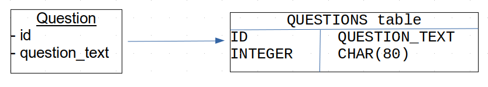

*Object-Relational Mapping* (ORM) is the mapping between objects (in code) and data stored in a relational database.  
In ORM's simplest form, a class is mapped to a table in a database;
each object is saved as (mapped to) a row in the table,
and attribute values are mapped to fields in the table.

Presentation: [Persistence and ORM](Persistence-and-ORM.pdf)

Terminology:

* **Persistence** in programming means retaining data values between executions of a program.  Persistence can be to a file, database, or some other form of non-volatile storage.
* **Entity** is a data type that is persisted. The model classes in MVC design are often entities.  
  - Example: Question and Choice in KU Polls are entities.
  - Not *all* models are entities, for example a Credit Card Validator class is part of an e-commerce domain model but may not contain any data to persist -- its just a service.

A programmer can write (low level) SQL commands in code to save values to a database. This is usually a terrible idea. Not only is the code redundant but it is a frequent source of security problems such as SQL Injection.

Instead of writing the low-level code to issue SQL commands to the database, use a framework that performs object-relational mapping.  It maps objects to rows in a relational database.

ORM needs to provide (at least) the 4 basic database operations:

* Create - save an object to the database
* Retrieve - recreate an object from data in a database
* Update - update the saved data for an object already persisted to database
* Delete - delete object from database

In this course we'll cover **what services** an ORM provides,
not **how** it does it.

*Retrieve* is the most complex of the CRUD operations.  It has 2 forms:

1. Retrieve by id. This is the easiest form. In Django:
   ```python
   q = Question.objects.get(id=3)   # Returns one object.
   ```
   `get` can get an object based on any specified field value, not just id.
2. Query by expression.  More complex, and queries can be chained together:
   ```python
   today = datetime.date.today()
   question_list = Question.objects.filter(pub_date_lte=today)
   first_question = question_list.first()
   ```

To be proficient is using ORM, you must learn to use the query language.

Don't write **stupid**, **inefficient** code like this:
```python
# Get all questions about programming 
questions = Question.objects.all()
prog_questions = []
for q in questions:
    if q.lower().find("programming") >= 0:
        prog_questions.append(q)
```
This is inefficient because it retrieves *all* the questions data as objects, even though you aren't interested in most of them.

It's stupid because the query language can do it for you:
```python
# Get questions about programming ('__icontains' is case-insensitive)
prog_questions = Question.objects.filter(question_text__icontains="programming")
```
This returns a `QuerySet` that you can further refine or manipulate.

### Django's ORM

Every "entity" in Django is a subclass of models.Model.  
The Model class provides CRUD operations to all subclasses:

`save()` - save or update an object in database    
`delete()` - delete this object from database (but it's still in Python, with id = None)    
`objects.all()` - retrieve all objects.  Try to avoid using this.    
`objects.get(id=n)` - get one entity having given id, or any specified attribute.    
`objects.filter(expression)` - get a QuerySet that can be chained and manipulated without accessing the dataase.

### The id Attribute

Every entity class needs an id field that is the Primary Key in the corresponding database table.  It has a unique value that identifies rows in a table, so that data in different tables can be "related" to each other.

Django automatically adds an integer `id` attribute to Model subclasses. You can override this by explicitly declaring an id field, but this is uncommon. Most other ORM frameworks require the programmer to explicitly declare and designate an id attribute in code.

The `id` attribute (this is the conventional field name, but not required) is used by ORM to indicate which objects have beeen *persisted* and which are *transient* (not persisted).  For example:

```python
>>> q = Question(question_text='Who are you?', pub_date=datetime.now())
>>> q.id
None
>>> q.save()
>>> q.id
5
>>> q.pk
5
>>> q.delete()  # delete from database, but object still in Python code
>>> q.id
None
```
Django automatically assigns a value to `id` when the object is persisted,
and removes it when the object is deleted.  The `id` values must be unique.

Django Models also inherit a property named `pk` that always refers to the id.
The value of `pk` and the `id` field are the same. 



A Primary Key (id field) that has no intrinsic meaning in the data is called a **synthetic id**.  It's usually auto-generated by the database, sequentially or a sequence generator.  Django's automatic `id` field is a synthetic id.

A Primary Key that *does* has meaning is called a **natural id**. An example might a student Id -- no two students can have the same student Id and the Id never changes, so we could use it as a primary key for a Students table. 

### Foreign Keys and Object Associations

Objects are related to each other using references. These relationships are saved as foreign keys in a database table.  The presentation slides have example.

Relationships may be many-to-1, 1-to-1, or 1-to-many.

A Question can have many Choices, so the relationship is 1-to-many.  But a Choice refers to only one question, so Choice-to-Question is many-to-1.

## Object Uniqueness and ORM

An important characteristic of ORM is that is should preserve object uniqueness.

* If we get an object from the database twice (using different queries), we should get references to the **same** object, not 2 copies of one object
  - If the question "Who are you?" has id 5, then these two queries should return the **same** object reference:
    ```python
    q1 = Question.objects.get(id=5)
    q2 = Question.objects.get(question_text='Who are you?')
    q1 == q2
    # should be True.  Is it?
    ```
* If other objects reference an entity, all the references should be to the **same** object.
  - For example, a `City` has an attibute named country that refers to the country it is in.  If we use the ORM to get cities for "Bangkok" and "Chiang Mai", do they refer to the **same** country object, or 2 identical copies of the country object for Thailand?

### Cascading

**Cascading** refers to whether an ORM operation on one object should *cascade* to objects it is associated with:

* If a Question object contains some choices, and we save the Question object to the database, should the Choices be automatically saved as well?

* If we *delete* a Question from the database, should all the Choices for that question be deleted from the Choices table, too?

You specified which operations should be *cascaded* in the code for model classes.

```python
class Question(models.Model):
    """A multiple choice question. 
    Each question has 1 or more Choices associated with it.
    """
    question_text = models.CharField(max_length=80)
    ...

class Choice(models.Model):
    """
    A choice is a potential answer to a question. A many-to-1 relationship.
    """
    choice_text = models.CharField(max_length=80)
    question = models.ForeignKey(Question,
                   on_delete=models.CASCADE)
```

### Lazy Instantiation

Creating objects from data in a database requires time (to retrieve the data) and memory (for the objects). ORM try to minimize this by not actually creating objects until they are referenced.

This is called **lazy instantiation**.

The Django QuerySet uses lazy installation.

For example:
```python
questions = Question.objects.all()
```
returns a QuerySet, but does not create objects yet. It won't create question objects until you try to access them.

Lazy instantiation is also applied to 1-to-many relationships.
```python
>>> question = Question.objects.get(id=2)

# the question set has not been instantiated yet
>>> type(question.choice_set)
django.db.models.fields.related_descriptors.create_reverse_many_to_one_manager.<locals>.RelatedManager
>>> question.choice_set.count()
8
```
The `choice_set` attribute is not a Python "Set". It's a Django type that can be filtered and object lazily retrieved.

### Design Patterns for ORM

There are 2 design patterns used in the design of ORM.
The patterns are illustrated in the ORM presentation slides.

* **Data Access Object** define a separate class that is responsible for performing ORM operations.  Usually this class is a singleton and created using a factory method.
* **Active Object** each entity class provides the ORM operations itself. This is usually done by making entities a *subclass* of a class that has all the code needed for the CRUD operations, so subclasses don't need to add any ORM code.  The Django Model class is an example.

### MVC Anti-Pattern: Anemic Models

Sometimes, the model classes do nothing but provide values of attributes. They don't provide any useful behavior themselves.

Martin Fowler calls these *anemic models*.

In the Django Polls app, the Choice class contains only `choice_text` and a `votes` counter.  That's pretty anemic.

The solution to *anemic models* is to examine your application for behavior that logically belongs to the models, and put the code for that behavior in the model.

As a simple example, to record a new vote for a Choice, instead of writing:
```python
choice.votes += 1
```
you could let the choice do it:
```python
choice.add_vote()
```

### Questions

After doing the Django tutorial, explain how relationships are mapped to database tables.
