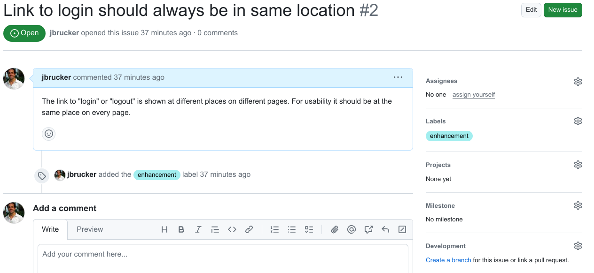

## Why Use Github Flow?

The main goal is:

- the master branch should contain only tested, reviewed, and ready-to-use code

Other benefits are:

- isolate development work and bug fixes, so each unit of work can be tested and approved separately
- avoid conflicts between work committed by different developers

The #1 rule of Github Flow is: *Anything on the main branch is always deployable.*


### Visual Summary of Github Flow


### Step-by-step

This includes the use of a task board.

1. Choose a feature or issue to work on from your project board. 
   - Move the task from "Backlog" to "In Progress" (or similar)
   - Add your name to the task so everyone knows you got it

2. Make sure your local copy of `master` (or main) is up to date!    

3. Create a new feature branch off of `master` using a **descriptive branch name**.    
   - Here are two ways to create the branch:
     1) **Create the branch locally** and then push it:
        ```
        git checkout -b my-feature-branch
        git push -u origin my-feature-branch
        ```
        > If your Git config has `push.default=upstream` (this is not the default), this "push" may not work. See ProGit or StackOverflow #2765421 for details.
     2) **Create branch on Github** and then check out & track: 
       ```
       # Use Github web interface to create the branch.
       # After you create the branch on Github, do:
       git checkout -t origin/new-branch-name
       ```
   > In ISP, points are deducted for non-descriptive branch names like "dev", "bugfix", or "feature".

4. Implement and test the feature on your feature branch.

5. Push your branch work to Github periodically and when you're done. 

6. Open a Pull Request. 2 cases:
   - you want feedback or help, even if the work isn't done yet
   - feature is done and you want feedback & approval to merge into `master`

7. Wait for feedback from team.

8. Apply the feedback. Update your branch code and push changes.

9. When team agrees to merge your work into master, then do:
   a. Merge locally and then "push" to master
     ```
     git checkout master
     git merge my-feature-branch
     # if any conflicts, resolve them and commit the changes
     # finally, push the work to github
     git push
     ```
   b. Merge on Github. First, push your branch updates to Github. Then use the Github web interface to merge.
   Github can merge and close a Pull Request at the same time!

10. Close the Pull Request with a descriptive message.
    - Please **do not** delete the branch.
    - Leave the branch as a record and to show your work.

11. Move the task on task board to "done".
    - Github may do this for you! (Task board automation)


## Responding to a Pull Request

Everyone on the team:

1. When you see a Pull Request, check the person's work and make comments.
   - often you can do this on Github, without checking out the branch
   - pay attention to detail. Do not **assume** the work is correct.
   - add comments and suggestions to the Pull Request

2. If the PR is a request to merge, you should indicate if you approve.

## Link Your Branch to an Issue

Note that you can convert Tasks (from a Task Board) into Issues.  This is a good idea.
And it enables automatition -- when you close an issue, it closes the Task.

Suppose your development "task" is an Issue in the Github Issue tracker.

Open the issue.  On the right side, under "Development" there is a link like this



* You can also link an issue to a Pull Request
* When the PR is closed, the issue is closed.

### How to Check That Your Local `master` is Up-to-Date?

There are different ways to do this.  Here are a few.

1. `git remote show origin`

2. Fetch the remote in order to update your references, then check:
   ```
   # make sure you are on the master branch
   git checkout master
   git fetch
   # status will tell if you if your local "master" is ahead or behind upstream
   git status
   ```

3. Same as above, but instead of `git status`:
   ```
   git branch -vv
   ```

4. Your solution?


