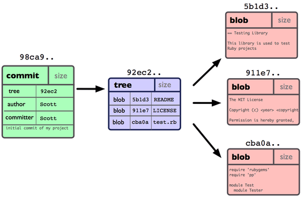
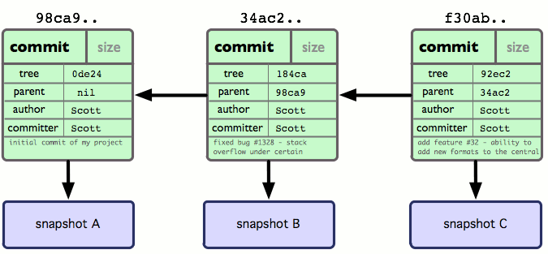
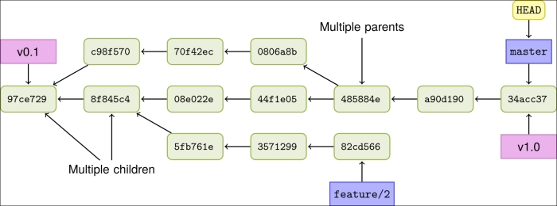

A **Version Control System** (VCS) manages versions of source code and other documents [Wikipedia](https://en.wikipedia.org/wiki/Version_control).  A VCS performs:

* authenticate users
* control who can view, copy, or change files (access control)
* maintain integrity of work 
  - you cannot overwrite a newer version of files with some work based on a much older version
  - git requires a new commit always be based on the current version of what is in the repository
* keep a history of all changes to every file, so you can view or checkout any version of any file(s)
* attribution of who changed what files, and reason for the change (commit message)
* items are "checked in" (committed) as a single transaction (*atomic*). A transaction can include renaming, moving, or deleting items as well as updates.
  - if the transaction fails in the middle of processing, nothing is changed in the repo.
* manage multiple variations (branches) of the same project, so that teams can work on different features without affecting other's work

**Git** is the dominant VCS in the world today, so we will focus on using Git. 
Other VCS are Subversion (a centralized VCS), and Mercurial.

## Git Basics

Presentation: [Git Basics](Git-Basics.pdf)

Know **at least** this:

[Git Basics][ProGitBasics], Chapter 2 of the excellent, free [Pro Git Book][ProGit].


**Visual** Guides to Git:

- [Learn Git Interactive](https://learngitbranching.js.org) interactive graphical tutorial, includes branch, merge, rebase, and more.
- [Visual Git Reference](https://marklodato.github.io/visual-git-guide) web page with illustrations of git commands.

If you are lazy, read my [Git Basics](git-basics), but [Git Basics][ProGitBasics] from *Pro Git* is better.


### Three Areas: Repository, Staging Area (Index), Working Copy

Video: [Git Workflow on YouTube](https://youtu.be/3a2x1iJFJWc) explains the 3 areas. Part of a course at Georgia Tech.

Git uses 3 special areas, and one special reference.

| Area             | Meaning |
|:-----------------|:--------|
| local repository | Git repository on your computer |
| staging area (index) | files and changes marked for commit, but not yet committed |
| working copy     | the copy of files you see and can edit. The working copy may include files 'tracked' by git and untracked files. |
| HEAD             | a label that refers to the commit your working copy is based on |


## Git Q&A 

Can you answer these?

1. How do you add file "main.py" to the staging area?
2. How to show what has been staged for commit?
3. How to remove "main.py" from the staging area?
4. What happens if you add "main.py" to the staging area, then edit it again? Do you need re re-stage the file?

Fixing Mistakes

1. You add `main.py` to the staging area (not committed yet). What command removes if from the staging area?
2. You make some changes in your working copy of `main.py`, but realize your work is wrong. How can you reset your working copy of `main.py` to the most recent committed to the repo?

## Understanding Git as a Graph

A git repository is structured as a **graph**. The **nodes** are commits.  

Each commit includes
* id - a hash of the contents
* time stamp
* author name and email
* message describing the commit
* link to previous commit
* link to files in this commit



Each commit (node) refers to previous commits:



Branches and HEAD are just **movable labels** referring to commits.
(This graph also contains *tags*, "v0.1", "v1.0").



Question: *Where is HEAD?*

## Visualize Git

[Git Visualizer][GitVisualizer] type git commands and see a graph of the result!

[Learn Git Interactive](https://learngitbranching.js.org) interactive graphical tutorial, includes branch, merge, rebase, and more.

* You should do the first 2 parts: *Intro Sequence* and *Ramping Up*
* Optional: *Moving Work Around* is useful, too.

## Example: View Student Projects using gitk

You can view all branches of a repo using `gitk --all`.

* [Dailigram](https://github.com/bankkeez/dailigram) ISP 2018 project.  It has many branches and tags.
> The commit messages are not good; later those students asked me to
> tell your class that commit messages are important!
> *You should write descriptive commit messages.*
* [Koocook](https://github.com/KooCook/koocook-dj) ISP 2019 project, by Mai and friends.  Very good use of issues to describe work. They created an organization (KooCook) as umbrella for their work.
* [VS Code](https://github.com/microsoft/vscode) by Microsoft has hundreds of branches, tags, and project docs in Wiki.

**Demo:** 

  - Show the graph of Dailigram. It uses branches and tags.
  - Look at all the files in the repo. 
  - Checkout the first commit using its hash: `git checkout xxxx` (*How can you find this?*)
  - Files in your working copy have disappeared!
  - View gitk again (notice the yellow node)
  - Checkout the final commit using its hash: `git checkout xxxx`
  - Working copy now matches final version
  - Note: non-tracked files are not affected when you use "checkout"

> When you clone a remote repository git only clones `master` (by default). 
> You can see references and history of other (remote) branches, 
> but the branch commits are not in your local repo.    
> To create a "tracking branch" (local branch that connects to a remote branch) use:
> `git branch -t remotes/origin/branch_name`

### Navigating the Graph

You can move around the graph, checkout or view older commits, view differences,
or **move** the labels!

How to refer to a node (commit):

* `master` use the name of a branch or tag
* `af840b` the first part of commit hash, any number of chars is OK
* `HEAD`  refers to the commit that your working copy is based on
* `HEAD~` (HEAD tilde) means "the predecessor of HEAD" 
* `HEAD~3` (HEAD tilde 3) means 3 commits before current HEAD
* `HEAD^` means a parent of HEAD, by default the first parent
* `foo^1` and `foo^2` are parents of a commit `foo` created by a merge (commit with 2 parents)
* `v0.1`  using the label on a node
* `bugfix~` the node **before** "bugfix"

1. what was changed in the most recent commit?
```
 git diff HEAD^ HEAD
 # to see just the names of changed files:
 git diff HEAD^ HEAD --name-only
```
3. checkout everything from a named commit (this also moves HEAD to that commit)
```
git checkout 3fa94b
```
3. checkout `main.py` from the commit before this one (does not change HEAD)
```
git checkout HEAD~ -- main.py
```
4. reset "master" to an older commit.  For example, reset to previous commit:
```
git checkout master
git branch -f master HEAD^
```

[Advanced Git Tips for Python Developers][git-tips-python] has good examples of navigating a git repository and using `git stash` to save uncommited changes in your working copy.


Github has nice visual tools for showing changes between any commits, 
but they are only available for the remote on Github -- not your local repo.

## Git Branches

* [Branching and Merging](https://git-scm.com/book/en/v2/Git-Branching-Basic-Branching-and-Merging) from the online [Pro Git Book][Git Book]
* My [branch and merge](branch-and-merge) notes
* [Merge Practice](Merge-Practice.pdf) in class exercise

Branches and Remotes:
* How `git push` handles branches depends on your configuration:
  ```
  git config --global push.default simple
  ```
* "sample" is the default behavior in Git 2.0.  Other choices are:
   - `simple` - push the current branch to upstream, but only if the upstream branch name is exactly the same
   - `upstream` - push the current branch to its upstream branch.
   - `tracking` - old, deprecated alias for `upstream`
   - `matching` - push all matching branches (branches on local that also exist on the remote)

### More About Branches and Remotes

* [How to use local branches with remotes](https://www.freecodecamp.org/forum/t/push-a-new-local-branch-to-a-remote-git-repository-and-track-it-too/13222) article has good exmaple of working with branches, such as:
   - Push your local branch to remote (creates remote branch): `git push -u origin branch_name`
   - Create a local branch to track a remote: `git checkout -b branch_name origin/branch_name` (and then maybe `git pull` to be sure your branch is up-to-date)
   - Rename (move) a branch: `git branch -m old_name new_name`
* [Git Branch Command Examples](ttps://www.thegeekstuff.com/2017/06/git-branch/) commands for 15 common tasks
* [How to Clone all Branches?](https://stackoverflow.com/questions/67699/how-to-clone-all-remote-branches-in-git)  
  - This Stackover question explains the problem and soluations. 
  - Cloning and tracking remotes branches is **not done** automatically when you clone a repo. You must do it yourself.

## Remotes and Github

[Remotes](Git-Remotes.pdf), remote branches, and tracking branches.    
[Exercise on Merging and Conflict Resolution](Merge-and-Conflict-Practice.pdf)    

Using Github [presentation](Using-Github.pdf) and [notes](Using-Github.md)

## Tags

A **tag** is a name assigned to a commit, like a bookmark, to make it easy to refer to it later.  On Github, tags are used to mark *releases* of a product.

[Git Tags](git-tag) - my notes on how to use tags.

## Common Use Cases

[Git-tips](https://github.com/git-tips/tips) how to perform common tasks in Git. 
* Common use scenarios
  - view history of commits
  - see what has changed (diffs)
  - recover deleted or mangled file
  - "undo" staging of files
  - "undo" a commit
  - checkout a particular commit or a particular file
  - work with remotes - push, fetch, pull. 
  - How to add, change, and view remotes.
  - revise a commit, such as adding files you forget

## Github Flow

Github Flow is a convention for using Git on a project.
Development work is always done on branches, and pull requests used for reviews before merging anything into master.  *Github Flow* is useful for both team and solo projects.

You should know the content of these docs:

* [Github Flow Illustrated Guide](https://guides.github.com/introduction/flow/)
* [Description on Githubflow.io](https://githubflow.github.io/). Step #5 -merge only after pull request review is important. I don't agree with Step #6 -deploy immediately. 

### Pull Requests

The Pull Request is an important part of Github Flow.  It's a request for help, feedback, or review on your work.

In Github Flow, you should always open a Pull Request before merging work from a branch into master.  When other people on your team open a Pull Request, you should *seriously* examine their work and offer feedback, suggestions, and even ciriticisms ("*criticize code, not people*").

[Pull Request Tutorial](https://yangsu.github.io/pull-request-tutorial/) shows how (and why) to use pull requests on Github.

[Commenting on Pull Requests](https://help.github.com/en/articles/commenting-on-a-pull-request) by Github, how to provide useful feedback to a Pull Request.

My [Slides on Pull Requests](Pull-Requests.pdf) - somewhat out-dated.

Optional and useful:

* [Github Branching Convention](https://gist.github.com/digitaljhelms/4287848) has [nice workflow diagram](https://gist.github.com/digitaljhelms/4287848#workflow-diagram) of using branches in Github flow, but maybe too complex for simple projects.
* [Github Flow](http://scottchacon.com/2011/08/31/github-flow.html) by a git coach, who outlines 6 rules:
  1. Anything on the master branch is deployable.
  2. For new work, create a *descriptive* branch off of master, e.g. `payment-auth`.
  3. Commit to that branch (locally) and regularly **push** to the same branch name on the shared repo (Github).
  4. Open a Pull Request to get help, ask for review & feedback, or request to merge.
  5. Merge only after a Pull Request review.
  6. Deploy immediately after review. (*I disagree with this.*)

## Specialized Git Uses

* [Git Aliases](aliases) how to create an alias for a git command, such as "git co" alias for "git checkout".
  - Aliases I use:
    ```
    # co as alias for checkout (as in Subversion)
    git config --global alias.co=checkout  
    # "git amend" as alias for "git commit --amend"
    git config --global alias.amend=commit --amend --no-edit
    # unstage a file "git unstage filename"
    git config --global alias.unstage=reset HEAD --
    ```

* [Submodules](submodule) to include another repository *inside* an existing Git repository tree.  Very useful for managing work, such as a separate repo for tests.

## Git Command Summary (cheatsheet)

[Git Cheatsheet](https://gist.github.com/raineorshine/5128563) Git commands in a bash shell file    
[Github Cheatsheet](/git/git-cheat-sheet.pdf) PDF file

## Resources

* [Pro Git Book][ProGit] and downloadable book [PDF][ProGitPdf]
  - online version has good navigation aids, but is *much shorter* than the book
* [Learn Git Interactive](https://learngitbranching.js.org) interactive graphical tutorial, includes branch, merge, rebase, and more.
* [Visualizing Git][GitVisualizer] interactive tool is view graph of a repository.
* [Think Like a Git][ThinkLikeaGit] visually understand how Git works.
* [Anatomy of a Git Commit](https://blog.thoughtram.io/git/2014/11/18/the-anatomy-of-a-git-commit.html) explains *what* is in a Git "commit". 

[ProGit]: https://www.git-scm.com/book/en/v2 "Pro Git online book on Git-scm.com"
[ProGitBasics]: https://git-scm.com/book/en/v2/Git-Basics-Getting-a-Git-Repository
[ProGitPdf]: https://github.com/progit/progit2/releases/download/2.1.245/progit.pdf
[ProGitAws]: https://progit2.s3.amazonaws.com/en/2016-03-22-f3531/progit-en.1084.pdf "Pro Git book v.2 PDF on AWS."
[ThinkLikeaGit]: http://think-like-a-git.net/ "Understand visually how git works"
[GitVisualizer]: http://git-school.github.io/visualizing-git/ "Interative tool draws a graph of commits in a repo"
[git-tips-python]: https://realpython.com/advanced-git-for-pythonistas/

## Good Git Questions Online

* [15 Git Questions Every Developer Should Know](https://medium.com/@gauravtaywade/15-interview-questions-about-git-that-every-developer-should-know-bcaf30409647)
* [Frequently Asked Git Questions](https://www.git-tower.com/learn/git/faq)
* [13 Essential Git Interview Questions](https://www.toptal.com/git/interview-questions)
