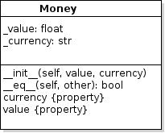
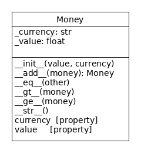

## Python Review (Done After the Github Warm-up)

1. Why use **properties** instead of simply allowing the application to access an object's attributes?
   - What we want:
     ```python
     m = Money(5, "Baht")
     print("You have", m.value, m.currency)
     ```
   - Allow direct access to an objevt's attributes ("expose the attributes"):
     ```python
     class Money:
         def __init__(self, value, currency):
             self.value = value
             self.currency = currency
     ```
   - Define properties and *hide* the attributes from other code:
     ```python
     class Money:
         def __init__(self, value, currency):
             self._value = value
             self._currency = currency
    
       @property
       def value(self):
            return self._value
     ```
   - **Question:**  Why use properties instead of exposing attributes?

2. Using properties to control access to attributes is an example of what **fundamental principle of OOP**? (Name this principle.)
   - Why is this a good thing?
   

3. A Banknote is a special kind of money that has a serial number and limited set of values (e.g. 20, 50, 100, ...).  
   - Banknote has all the attributes and behavior of Money.
   - Banknote adds a new attribute: `serial_number`
   - **Goal**: We want to avoid duplicate code and duplicate logic.
   - **Question**: How should we implement the Banknote class?
   - **Exercise**: draw a UML class diagram of your design

4. In OOP, one class can reuse the methods and attributes from another class, without duplicating the code.  What is the name of this **fundamental principle of OOP**?

5. Write a `Banknote` class in the file `money.py`.  
   - Write the code *after* the Money class and leave **2 blank lines** between classes (Python Coding Style).
   - Do **not** duplicate any code from Money.
   - The `Banknote` constructor has the same parameters as Money.    
   - Banknote chooses its own unique serial number, starting with 1,000,000,000.
     1. Define a *class attribute* named `next_serial_number` 
     2. Write a *class method* named `make_serial_number` to return the serial number and increment `next_serial_number`.
     ```python
     class Banknote(???):
          """Paper money with a unique serial number."""
          next_serial_number = 1000000000     # a class attribute

          # TODO write the constructor

          @classmethod
          def make_serial_number(cls):
              """Return the next available serial number."""
              serial = Banknote.next_serial_number
              Banknote.next_serial_number += 1
              return serial
     ```
   - Define a **read-only property** named `serial_number` to prevent any code from changing the serial number.

6. How did you write the constructor for Banknote?
   - Wrong:
     ```python
     def __init__(self, amount, currency):
        self._amount = amount       // same as Money
        self._currecy = currency    // same as Money
        self._serial_number = Banknote.make_serial_number()
     ```
   - Right:
     ```python
     def __init__(self, amount, currency):
        // Let Money constructor manage its own attributes
        __________________________

        self._serial_number = Banknote.make_serial_number()
     ```

7. The software for a Store creates an `Invoice` when a customer buys something.
   The total amount on the Invoice is "Money".
   - Should `Invoice` be a subclass of Money?  Give a reason for your answer.

8. What is another way to model the relationship between `Invoice` and `Money`? (without using inheritance)
   - Draw a UML class diagram of your design.
   - OO Principle: *Prefer composition over inheritance.*
     - That means *Prefer association over inheritance.*

9. Add *type hints* to the Money constructor to indicate that
   `value` should be `float` and `currency` should be `str`.  How?
   ```python
   class Money:

       def __init__(self, amount          , currency        ):
          pass
   ```
   - Add a *type hint* to `__eq__` to indicate that it returns `bool`.

10. Methods like `__eq__` and `__str__` are called **magic methods**.    
    Why?

11. We invoke `__eq__` by writing `a == b` where `a` and `b` refer to some object with an `__eq__` method.
    - How do we invoke `__str__`?

12. We want to be able to add Money objects like this:
    ```python
    m1 = Money(5, 'Baht')
    m2 = Money(20, 'Baht')
    sum = m1 + m2
    print(sum)
    25 Baht
    ```
    - What method should we write? 
    - What parameter(s) does this method need?

13. **Exercise:** Write the "add" method in Money and test it.
    1. in `money_test.py` there are 2 "skipped" tests for add.  Remove or comment the `@pytest.mark.skip` annotation to use the tests.
       ```python
       # @pytest.mark.skip("skip this test until ...")
       def test_add():
       ```
    2. Run pytest.  The 2 tests should **fail**.
    3. Write code for "add" method until the tests **pass**.

14. It does not make sense to add money with different currencies:
    ```python
    m1 = Money(10, 'Baht')
    m2 = Money(20, 'USD')
    m1 + m2
    THIS IS NONSENSE
    ```
    - What should we do if someone tries to add Money with different currencies?
    - What should we do if someone tries to add Money to something that is not Money (like a number or string)?
    - **TODO** Modify the "add" method to **raise `ValueError`** if the currencies are different.
    - **TODO** In add, raise `TypeError` if the parameter is not an instance of Money (or a subclass of Money). Use `isinstance(obj, Classname)` to test it.
    - Example: `isinstance(5, int)` is True

15. Commit and push your work:
    - Commit changes with a **descriptive** git comment (-m)
    - Software Process: Always write a **descriptive** comment when you commit work, such as "*completed `__add__` method and unit tests*".
    - Push to Github

16. Go to Github and observe that it automatically runs your pytests.  The tests should all pass.


### Collections You Should Know

Names these collections and show how to use them.

1. An ordered collection of objects, which may contain duplicates.
   - you can add or remove items at any position in the collection
   - you can get any element using an index, e.g. `students[3]`
   - you can extend the collection using `append`, e.g. `students.append(student)`
   - Python has syntax called "comprehensions" that save you a lot of coding when working with this collection

2. An unordered collection of objets, without duplicates.
   - you can add or remove elements, but cannot specify their location in the colection
   - to get all elements, use an iterator, e.g. `for x in collection`

3. A collection of key-value pairs.
   - add or replace pairs using: `foo[key] = value`
   - remove a key/value using: `del(foo[key])` (Python's *ugliest* syntax)
   - iterate over keys:  `for key in foo`
   - iterate over values: `for x in foo.values()`


### Reading a File

To count all the lines and words in a text file we could do this:
```python
import re
file = open("data.txt")
num_lines = 0
num_words = 0
# read the file into a list, one line per list element
data = file.readlines()
for line in data:
   num_lines += 1
   # \s = any whitespace character, \s+ = one or more whitespace char
   words += re.split("\\s+", line)
   num_words += len(words)
```

1. Why is it **not** good to read the entire file into a list (`data`)?
2. What is a better way to process the lines in a file?

**Coding Exercise** for List and File I/O: 

1. Write a Wallet class that has a list of Money objects.
2. In Wallet write a method named `load(filename: str)`.
   - `load` reads the file line-by-line, creates a Money object using the data, and saves the Money object in the wallet.
   - `load` returns the number of Money objects created.
   - Each line of the data file contains 2 words: an amount and a currency. The data file may also contain blank lines or lines containing only spaces, which should be ignored.
   - Example data file:
     ```
     10 Baht
     5  Rupee

     50 Baht
     ```
3. Write the methods should below:

| Method           | Meaning
|------------------|--------------------
| `load(filename)` | method to read money data from a file, create Money objects, and add them to the wallet.
| `is_empty(): bool` | True if wallet is empty, false otherwise.
| `balance(currency: str)` | Total value of money matching the named currency. Ignore case of letters in currency name.

4. What is missing?  We need a way to *Iterate* over all the money in the wallet.  Python has *Iterators* for this.
   - Iterator: discussed in class
   - How to create at Iterator:
     1. Write a method named `__iter__` that returns an Iterator
     2.

### What to Submit

Push your revised `money.py` and `money_test.py` to Github.




### Magic Methods


| Method           | Description                   |
|:-----------------|:------------------------------|
| `__add__`   | "a + b", return the result as a new object. (3) |
| `__gt__`    | Test `self > other`. For Money, first compare currencies, then the value. |
| `__ge__`    | Test `self >= other`. True if `self > other` or `self == other`. |
| `__str__`   | Return string representation. |
| `__mul__`   | "a * b" (multiply), return result as a new object. `a * b` invokes `__mul__(a,b)`. |
| `__rmul__`  | Multiply 2 objects where "self" is on the right of multiply sign. `a * b` invokes `__mul__(b,a)` in the class of `b`. |


