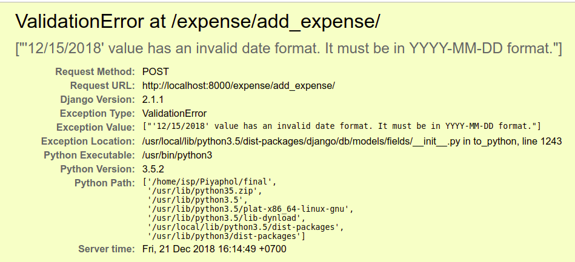

## Comments on Programming Exam

It is great that you can write a useful, working web application in only 4 hours!  This class *raises the bar* for future SKE students.  

In grading, I looked for:
* correctness of logic and code
* code shows you understand what you are writing
* use of good coding practices

Score awarded as follows:

| Feature |  Percent |
|:--------|---------:|
| List of 20 most recent expenses, sorted by date | 40% |
| Expense model class with correct attributes | 10% |
| Add Expense                  | 10% |
| Validation of Add Expense input dialog | 10% |
| Report of total expense by month | 10% |
| Unit tests                       | 10% |
| Development branch and commits on Github |  5% |
| Instructions to build and run in README | 5% |
| Task Board with tasks               | 0% |

*Task Board* - some students had a problem accessing Github at start of the exam, which prevented them from creating a task board.  To be fair, I didn't count the task board.

### Grading Details

1. `localhost:port/expense/` shows List of 20 most recent expenses, by date.  Graded on a scale of 0-10:
    - -1 if page only shows "Welcome to Expense Tracker" (or similar).
    - -1 no links to other pages, e.g. "Add Expense". 
    - -1 more than 20 expenses shown
    - -1 expenses not sorted by date
    - -1 date, description, or amount not shown
    - -1 or more if errors or very poor formatting
2. `Expense` model class.
    - should have exactly 3 fields: date as DateField, description as CharField, amount as FloatField or DecimalField
    - -1 if date is CharField (should be DateField), -2 if amount is CharField (should be DecimalField)
    - -1 for poor class name such as "Book" or "Menu", or poor field names such as "title", "pub_date"
    - -2 if Expense class has extra fields, such as `is_done`, `category`
    - -1 if `amount` field is too small for typical expenses.  Should accept at least 0 to 9,999.99.
3. `Add Expense` dialog should have labels and input fields for the 3 expense attributes.
    - deduct 1-2 if no labels on input fields. How will user know which value to input in which box?
    - no credit if it doesn't add the expense to saved expenses
4. `Input Validation`. I tried submitting: a) a blank form, b) invalid date, c) omit description or 1-letter description, d) negative amount, e) amount 0.25 or 0.01 (should be allowed)
    - -2 per field with no validation
    - -1 validator does not allow decimal values (12.25)
    - -2 validator returns an exception page (throws exception) instead of a message on the Add Expense page	
    - -1 validator silently discards invalid input with no feedback
5. `Report of Total by Month` must be correct and code is well written to get credit.
    - I graded this item for code quality and correctness of logic
    - partial credit only for nearly correct code
    - no credit for bad code, even if result is correct (examples below)
6. `Unit Tests` must run automatically when I type: `manage.py test`.  Should have at least 2 tests that are not redundant.
    - -5 if tests don't run but problem can be easily fixed
    - Many apps have wrong test filenames or tests in a directory without `__init__.py` file, so they don't run.
    - only partial credit for trivial tests such as testing a "get" method.  
    - no credit for testing code that is part of Django Model, such as saving an object and then querying it.
7. `Git branches` - repo has a development branch on Github.
8. `README.md` - has correct, formatted instructions to configure and run your application
9. `Task Board` not graded since some students could not access the Github Projects page at start of exam.

### Too Strict in Grading?

Since you had very limited time to write the application, should I overlook minor errors, such as List of Expenses showing more than 20 items?  Or, "Add Expense" accepts an empty descripton?

Software today is **plagued** with bugs. The costs of these bugs is huge and the bugs hurt everyone.

Developers need to develop good habits to produce correct software, and not tolerate avoidable mistakes.  So, I decided to deduct for mistakes that you could have avoided or detected & fixed yourself.


## Some Specifics and Code Ideas

### Expense model

Model should contain:
```python
class Expense(models.Model):
    date = models.DateField(default=django.utils.timezone.now)
    description = models.CharField(max_length=80, null=False)
    # OK to use FloatField, but DecimalField is better
    amount = models.DecimalField(default=0, max_digits=12, decimal_places=2)

@classmethod
def total_by_month(cls, year):
    """Return list of monthly totals for specified year, indexed by month"""
    expenses = Expense.objects.filter(date__year=year)
    totals = [0]*13  # array of 13 elements. Ignore element 0.
    for expense in expenses:
        m = epxense.date.month
        totals[m] += expense.amount
    return totals
```

The `total_by_month` method isn't required, but its much easier to test this important code if its in the model rather than a controller (Django "view").  Putting it in the model is recommended by the *Information Expert* design principle.

#### How many digits for DecimalField?

What is the biggest expense we might encounter?  For Thai currency, probably 9,999,999,999.99 is big enough.    
Even Thaksin doesn't spend that much. That would be `DecimalField(max_digits=12,decimal_places=2)`.  I accepted 6 or more for max_digits.

The following are not acceptable:
* `models.DecimalField(max_digits=5,decimal_places=2)` the largest expense would be 999.99 (too small)
* `models.DecimalField(max_digits=50,decimal_places=2)` is way to large! This will make the field width very large, and complicate conversion to Python float type (which cannot store that many digits). `max_digits=50` can hold: 
999,999,999,999,999,999,999,999,999,999,999,999,999,999,999,999.99.

### Setting Default Value for Date Field

Some people tried to set the default date to today's date in Expense like this:
```python
class Expense(models.Model):
    date = models.DateField(default=datetime.today())
```

When you run `python manage.py makemigrations`, Django **warns you** that this is not what you want.
The message is:
```
System check identified some issues:

WARNINGS:
expenses.Expense.date_ex: (fields.W161) Fixed default value provided.
	HINT: It seems you set a fixed date / time / datetime value as default for this field.    
This may not be what you want.    
If you want to have the current date as default, use `django.utils.timezone.now`
```
This means that you should write:
```python
class Expense(models.Model):
    date = models.DateField( default=django.utils.timezone.now )
```
This way the function `timezone.now` will be invoked when a new Expense object is created, instead of being set to the value of today() when `makemigrations` is run.

No deduction for this, but you should pay attention to warning messages.
(PAD Advise: "*Treat warnings like errors*")

#### Model Validators

Some students included validators as part of their Expense model.  For example:
```python
from django.core.validators import MinValueValidator,MinLengthValidator

class Expense(models.Model):
    date = models.DateField(default=django.utils.timezone.now)
    description = models.CharField(max_length=80, null=False,
        validators=[MinLengthValidator(2)]
        )
    amount = models.DecimalField(default=0,
        max_digits=12, decimal_places=2,
        validators=[MinValueValidator(0)]
        )
```

This is good if the input Form uses the validators.
If you write your own view code for add_expense, then you need to check if values are valid.   If any data are invalid, then add an error message(s) to the form's context and redisplay the "Add Expense" input form.

If you use a Django Form class, it does this automatically.

Regardless of how you validate input, input errors should be shown on the 'Add Expense' form so the user can correct them.  

**Don't** return an exception screen like this:



See: Django [Form and Field Validators](https://docs.djangoproject.com/en/2.1/ref/forms/validation/) explains how validators are used.

### Report of Monthly Expenses

For this part, I checked for reasonably good code and coding practices.

Some unacceptable coding practices are:

* using global variables and side-effects instead of local variables
* querying all objects in a database table instead of only the objects you want
* writing redundant code instead of standard programming constructs.

Here are some examples and how to improve them.


#### Example 1

This view method for monthly total expenses has problems:

1. Getting all objects from database (`objects.all`) is inefficient, even though Django tries to make it efficient by returning an iterator.
2. Using a global variable `totals` instead of a local variable to store totals.  Don't depend on side-effects if you can avoid it.
    - **Bug** if you display the Monthly Report and click "refresh" the monthly totals increase each time you refresh. This also occurs each time you show the report from the home page. This is because the global `total` array is initialized only once.
3. Long `if ... elif ...` instead of just computing the index.
4. Calling total_exp once for each expense, instead of calling it once with a list of expenses to total.
6. Not using Python native syntax to initialize `totals` list. (minor issue)

```python
### The calling code is like this:
    all_exp = Expense.objects.all()
    for exp in all_exp:
        total_exp(exp)

total = [0,0,0,0,0,0,0,0,0,0,0,0]
def total_exp(exp):
    if exp.get_date().year == date.today().year:
        if exp.get_date().month == 1:
            total[0] = total[0]+exp.get_amount()
        elif exp.get_date().month == 2:
            total[1] = total[1]+exp.get_amount()
        elif exp.get_date().month == 3:
            total[2] = total[2]+exp.get_amount()
        elif exp.get_date().month == 4:
            total[3] = total[3]+exp.get_amount()
            print(total[3])
        elif exp.get_date().month == 5:
            total[4] = total[4]+exp.get_amount()
        elif exp.get_date().month == 6:
            total[5] = total[5]+exp.get_amount()
        elif exp.get_date().month == 7:
            total[6] = total[6]+exp.get_amount()
        elif exp.get_date().month == 8:
            total[7] = total[7]+exp.get_amount()
        elif exp.get_date().month == 9:
            total[8] = total[8]+exp.get_amount()
        elif exp.get_date().month == 10:
            total[9] = total[9]+exp.get_amount()
        elif exp.get_date().month == 11:
            total[10] = total[10]+exp.get_amount()
        elif exp.get_date().month == 12:
            total[11] = total[11]+exp.get_amount()
        else:
            pass

```

The above code can replaced by just this:
```python
### In the calling method:
    this_year = datetime.date.today().year
    all_expense = Expense.objects.filter(date__year = this_year)
    totals = total_expense(all_expense)

def total_expense(expenses):
    """Compute monthly totals for a list of expenses.
       Return a list of totals, indexed by month, with 1=January.
    """
    total = [0]*13
    # add expenses to monthly totals.
    for expense in expenses:
        m = expense.date.month
        total[m] += expense.amount
    return total
```

#### Example 2

1. Hard-coding year "2018" into code.
2. Verbose initialization of `total1` list.
3. Abbreviated variable names: `ex` (for readability, don't abbreviate)
3. Retrieving all objects from the database instead of only objects you need.
4. `Expense.amount` is defined as a `FloatField`, so writing `float(i.amount)` is unnecessary.
5. Ridiculous if-elif-elif instead of directly using Expense.month as index.

```python
def report(request):
    ex = Expense.objects.all()
    total1 = [["Jan",0.0],["Feb",0.0],["Mar",0.0], ["Apr",0.0],["May",0.0],["Jun",0.0],
        ["Jul",0.0],["Aug",0.0],["Sep",0.0], ["Oct",0.0],["Nov",0.0],["Dec",0.0]]
    for i in ex:
        if i.date.year == 2018:
            if i.date.month == 1:
                total1[0][1] = total1[0][1] + float(i.amount)
            elif i.date.month == 2:
                total1[1][1] = total1[1][1] + float(i.amount)
            elif i.date.month == 3:
                total1[2][1] = total1[2][1] + float(i.amount)
            elif i.date.month == 4:
                total1[3][1] = total1[3][1] + float(i.amount)
            elif i.date.month == 5:
                total1[4][1] = total1[4][1] + float(i.amount)
            elif i.date.month == 6:
                total1[5][1] = total1[5][1] + float(i.amount)
            elif i.date.month == 7:
                total1[6][1] = total1[6][1] + float(i.amount)
            elif i.date.month == 8:
                total1[7][1] = total1[7][1] + float(i.amount)
            elif i.date.month == 9:
                total1[8][1] = total1[8][1] + float(i.amount)
            elif i.date.month == 10:
                total1[9][1] = total1[9][1] + float(i.amount)
            elif i.date.month == 11:
                total1[10][1] = total1[10][1] + float(i.amount)
            elif i.date.month == 12:
                total1[11][1] = total1[11][1] + float(i.amount)

         return render(request, 'expense/report', {'totals': total1})
```

This code can be simplified as:
```python
import calendar, datetime

def report(request):
    this_year = datetime.date.today().year
    expenses = Expense.objects.filter(date__year=this_year)
    totals = [ [calendar.month_name[m][0:3],0.0] for m in range(1,13) ]

    for e in expenses:
        month = e.date.month - 1  # subtract 1 for jan=0, feb=1, etc.
        totals[month][1] += e.amount
    context = {'totals': totals}
    return render(request, 'expense/report', context)
```
In this code, `calendar.month_name[m]` returns the name of the month, such as "January".  `calendar.month_name[m][0:3]` gets the first 3 letters of month name, as in the original code.


