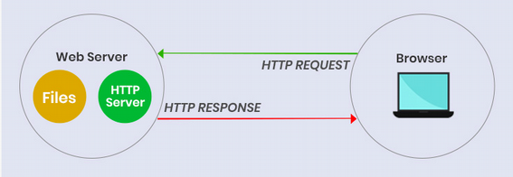
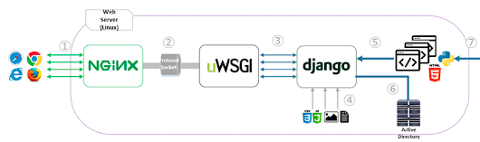

The web uses the HTTP protocol for messages and TCP/IP for transport.
So, it helps to have some understanding of IP, TCP, and HTTP. These are layered protocols:

* Internet Protocol (IP) provides addresses and routing for all traffic on the Internet.
* Transmission Control Protocol (TCP) defines how to maintain a virtual connection or conversation between applications, and adds reliability to IP. A TCP segment is carried *inside* an IP packet.
* HyperText Transport Protocol (HTTP) defines the format and protocol for communication by web applications and web services. HTTP is the *payload* inside TCP (in version 3, HTTP will switch to using UDP).

Presentation: [Introduction to HTTP](HTTP.pdf)     
Practice: [HTTP Exercise](HTTP-in-Action.pdf) send and receive HTTP yourself!     
[UC Berkeley Intro to Web & HTTP](Intro-web-and-tcp-UCB.pdf) from Edx course on *Engineering Software as a Service* (very good).    
[My Intro to TCP/IP](intro-tcp-ip) one page.

### HTTP Exercises Require netcat or ncat

* **netcat** (nc) is included with Linux and Mac OSX, or add it as a package.
  - Windows users: use ncat instead.
* **ncat** is a newer implementation of netcat that supports TLS/SSL.  It uses the same syntax as netcat, with added options.
  - https://nmap.org/ncat/
  - written by the author of the well-known `nmap` port scanner
* [netcat command summary](netcat_summary_sans.pdf) from SANS Institute

Test that netcat/ncat is working.  In a terminal (shell) window enter:
```
ncat -v -l -p 8000

#  or, if you are using netcat (nc)

netcat -v -l -p 8000
```
then in a web browser, open the URL `http://localhost:8000`.    
You should see the HTTP request (as text) in the ncat window.  
You can close the terminal window or type CTRL-C to kill the netcat process.

## Web Frameworks

A **framework** provides reusable code for creating a particular type of application.
Web frameworks provide both code and services, such as parsing HTTP requests, formatting HTTP responses, managing cookies and sessions, and much more.
Modern web apps are primarily written using web frameworks; writing a
web app "from scratch" is a huge project.

**Back-end** frameworks run a a server, handle client requests, create responses (web pages), manage data, and contain application logic.  For many apps, a backend framework is all that is needed.

As of 2020, some of the most used frameworks for new applications are:

* Django - Python
* Spring or Spring Boot - Java
* Rails - Ruby
* ASP.net MVC - C# and other .Net languages
* Flask - Python
* Express - Javascript
* Lavarel - PHP

A **front-end** framework runs in the web browser (on the client), 
to provide a richer user experience and more client-side functionality.
They need a back-end to proide data and handle requests,
usually via a web services interface.

The most popular front-end frameworks in 2020, all in Javascript, are:
* React
* Angular and Angular.JS
* Vue.js
These frameworks also require jQuery.

To learn more about web development and web frameworks, try:

* [Web Frameworks][fullstackpython-web-frameworks] - what a web framework does, and how to compare Python web frameworks, by [Full Stack Python](https://www.fullstackpython.com)
* [Client-Server Overview](https://developer.mozilla.org/en-US/docs/Learn/Server-side/First_steps/Client-Server_overview) describes HTTP requests and responses, difference between static and dynamic content, and what web frameworks do.  They mention Django and Flask for Python. 
The [Mozilla Develper Network][MDN] (MDN) has excellent, in depth tutorials on HTML, CSS, and Django (among others).

Presentation slides: [Web Servers and Web Apps](Web-Apps-and-Web-Servers.pdf)

## Learning Web Development

This is a huge subject.  Web developers need some knowledge of:

* HTML and CSS - for creating and styling web pages
* HTTP protocol - the semantics of HTTP requests and responses
* Javascript - enough to use a Javascript library or front-end framework
* Backend framework - how to create the back-end for your application
* How to deploy your web application in a production-quality web server

Two excellent, recommended places to learn are:

[Mozilla Developer Tutorials](https://developer.mozilla.org/en-US/docs/Web/Tutorials) on HTML, CSS, and Javascript. There is also a great tutorial on Django.

[W3Schools](https://www.w3schools.com) has tutorials and references for everything related to the web.  Good place to learn HTML, CSS, and Javascript. The MDN tutorials have better explanation of underlying concepts and technology.

---

## Resources

[HotFrameworks][hotframeworks] has rankings of web frameworks based on number of uses in Github projects and Stack Overflow mentions.  The results are biased in favor of frameworks that are popular among newbie developers.

[Web Architecture 101](https://engineering.videoblocks.com/web-architecture-101-a3224e126947) introduces concepts and components in real-world web deployment.

[The Web in Depth](https://www.hacker101.com/sessions/web_in_depth) from Hacker101.com. This video tutorial emphasizes web security. The first part is basics of HTTP.

[Mozilla Developer Network][MDN] (MDN).

[MDN]: https://developer.mozilla.org
[hotframeworks]: https://hotframeworks.com "Popularity of different web frameworks based on appearance on Github and Stackoverflow." 
[calavijo]: http://blog.websitesframeworks.com "Comparison of Web Frameworks - Rails, Grails, Django, Code Igniter"
[calavijo_pdf]: https://acceda.ulpgc.es:8443/bitstream/10553/11428/3/0695395_00000_0000.pdf "PDF of report comparing Rails, Grails, Django, Code Igniter"
[fullstackpython-web-frameworks]: https://www.fullstackpython.com/web-frameworks.html

---

## Comparison of Web Frameworks
 
[4 Python Web Frameworks Compared](https://talkpython.fm/episodes/show/149/4-python-web-frameworks-compared) episode of the "Talk Python" podcast.  
He compares Django, Flask, Pyramid, and Tornado, the
important differences between them, 
and which framework is best suited for different kinds of projects.
For getting a site up quickly, he prefers Django.

[Empirical comparison of Rails, Grails, Django, Code Igniter][clavijo] compared time students needed to (a) complete some programming problems in each language, (b) develop a blogging web site in each one.  
**Django** was the most productive of the 4 frameworks.

For Java, the perennial top frameworks are:

* Spring MVC
* Struts
* JavaServer Faces (JSF)
* Wicket
* Vaadin
* Play

I'd recommend using [Play](https://playframework.com) since it's easy to get started, has a modern architecture, and doesn't use JavaEE or JSP (Java Server Pages). Play's application structure is similar to Django or Rails, and apps can be written in either Java or Scala.

If you only want to create a RESTful API, Spark is worth considering. Spark is a micro-framework for both web apps and RESTful web services.

[HotFrameworks][hotframeworks] charts the popularity of frameworks over time.
But its not representative of what is used for *production* web sites.

Top rankings in 2020 were:

| Framework      |  Score | Description        |
|:---------------|-------:|:-------------------|
| React          |    99  | Front-end, Javascript |
| ASP.Net MVC    |    95  | Front and back-end, ASP and .Net languages |
| Angular        |    93  | Front-end MVC, Javascript |
| Ruby on Rails  |    93  | Back-end, Ruby     |
| Vue.js         |    93  | Front-end, Javascript |
| Django         |    92  | Back-end, Python   |
| Lavarel        |    91  | Back-end, PHP      |
| Spring         |    90  | Back-end, Java     |
| Express (Node) |    87  | Back-end, Javascript |
| Flask          |    85  | Back-end, Python   |
| Symfony        |    84  | Back-end, PHP      |
| ...            |    ..  | ...                |
| Play           |    75  | Back-end, Java or Scala |
| Vaadin         |    61  | Back-end, Java |
| Struts         |    58  | Back-end, Java |


## Web Servers

**Web Servers** provide access to web content, and provide services such as filtering, authentication, and URL rewriting.  Two types of content provided are:

* **static content** - html pages in files, images, audio, and video
* **dynamic content** - content generated on-the-fly in response to a request.

What are the top web servers on the net?
* [Netcraft Web Server Survey](https://news.netcraft.com/archives/category/web-server-survey/) monthly prevelance of different web server software.
* [What's that Site Running?](https://sitereport.netcraft.com/) find out what is running www.ku.ac.th. 
* [BuiltWith.com](https://builtwith.com) reports what software a web site appears to be using.

Web server for **static content**:



**Dynamic content** is created by web applications in response to client requests.
A web server that hosts one or more web apps is often called a **web application server**.

A web server like Apache httpd or nginx doesn't run web applications itself.  Instead, it passes web requests to a module that provides an interface between the web server and a web app container that runs Java, Python, or PHP to execute the web app.

Below, an Nginx server uses the uWSGI module to run a web app written with Django.



WSGI (web server gateway interface) is a standard for communication between a web server (nginx or Apache) and web app container. uWSGI and Gunicorn implement this standard, so either can be use to run Python web apps.

Java has well developed standards and API for the services that a web app server should provide, which is one reason why Java is popular for large web apps. 
The Java standards are called *Java EE* and a lighter-weight subset called the *Java Servlet API*. A Java web application using these API can be run in any conformant application server (portability).
Well known Java app containers are Glassfish, IBM WebSphere, JBoss, Jetty, and Tomcat.

