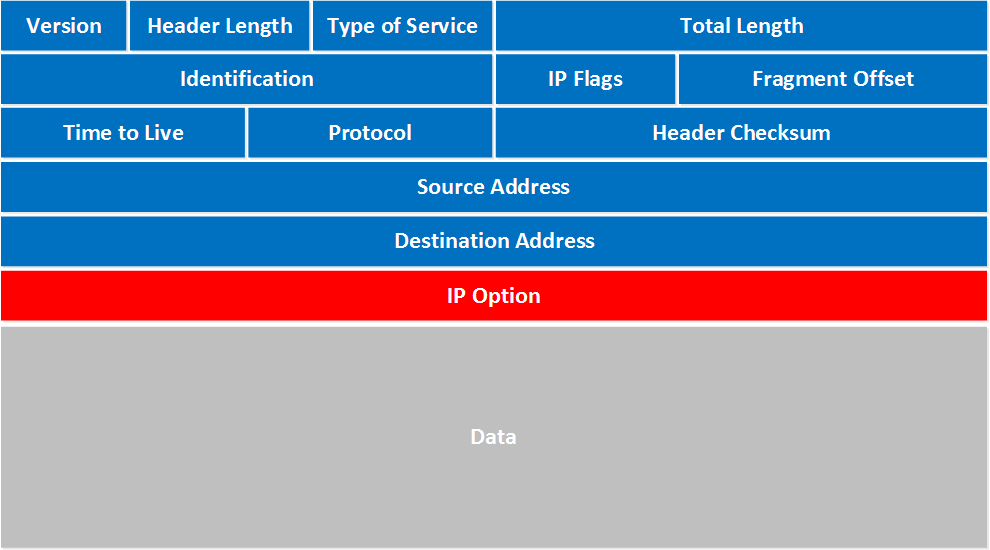

The World Wide Web primarily uses the HTTP protocol for communication.
HTTP is an "application level" protocol that is transmitted inside of
TCP/IP packets.

This page provides a brief overview of IP and TCP.

A separate page (and presentation) cover HTTP.

## Internet Communication and IP

The Internet is a heterogeneous **packet switched** network.
All communication is done in packets, which are individually routed
from source to destination.

The **Internet Protocol** (IP) defines the format of these packets,
addressing, and some rules for communication.  The main purpose of IP
is to provide **addressing** so that hosts on the Internet can **communicate**.

An IP packet looks like this:

<table border="1" width="100%">
<tr valign="top">
<td markdown="span" width="10%">Preamble</td>
<td markdown="span" width="20%">**Sender IP Address**</td>
<td markdown="span" width="20%">**Destination IP Address**</td>
<td markdown="span" width="50%" align="center">**PAYLOAD (Data)**</td>
</tr>
</table>

- The **Preamble** contains many fields such as packet length, version number, checksum, and **payload protocol type**. ([details below](#complete-ip-packet-format))
- The **Sender IP Address** and **Destination IP Address** are IP v.4 or v.6 addresses.
- The **PAYLOAD** is the message.  For HTTP, this will be a TCP packet!

**IP Addresses** can be either IP version 4 (4-byte) or version 6 (16-byte):

**IP version 4**: a 32-bit number. 
   - Human readable form: 158.108.216.5  (www.ku.ac.th)
   - Computer form: 0x9e6cd805 (hexadecimal) or 10011110 01101100 11011000 00000011 (binary).

**IP version 6**: a 128-bit number.
   - Human readable form: 2406:3100:1010:100:0:0:0:5 abbreviated as 2406:3100:1010:100::5 (still hard to read)
   - Computer form: 128 binary bits

**Important Summary**    
Communication on the Internet is done by **packets** using the IP format and protocol.  Each source and destination has an IP address.  Some machines have more than one IP address. 

Laptops, mobile phones, IoT devices, and personal computers don't usually have a permanent IP address.  Instead, it is dynamically assigned (and may be a *private address*) each time the device connects to a network.

An IP packet contains a **payload** which can be anything.  Common types for the payload are TCP, UDP, and ICMP (control and status messages between networking hardware).

## TCP Protcol - The Message Inside an IP Packet

The [Transmission Control Protocol][] (TCP) provides a reliable, connection-oriented service.  It allows two hosts to estabish a virtual connection and send messages back and forth.  It also provides some reliability -- it detects when a packet is lost and will ask the sender to resend it -- and ensures packets are delivered in the correct order, and *reassembles* packets into complete messages.

A TCP Packet looks like this:

<table border="1" width="100%">
<tr valign="top">
<td markdown="span" width="15%">**Sender Port Number**</td>
<td markdown="span" width="15%">**Destination Port Number**</td>
<td markdown="span" width="10%">**Sequence Number**</td>
<td markdown="span" width="10%">**Other fields**</td>
<td markdown="span" width="50%" align="center">**DATA** (an HTTP packet)</td>
</tr>
</table>

The **Sender Port** and **Destination Port** are numbers 0-65,535 (2 bytes) that identify which process or service to receive the packet, and who sent it.    
For example, a packet sent to KU's web server use port 443, the standard https port.

Port numbers are **essential** because:

- a **server** may have MANY different services accepting TCP connections, such as email (SMTP), HTTP and HTTPS, and MySQL.  Each service uses a different port, so the operating system can direct packets to the correct service.

- a **client** may connect to many different servers or have many connections to the **same** server.  In a browser, you can open many tabs that connect to the same web server -- each tab is a separate connection, using a separate sender port number.

**4 Numbers Uniquely Identify Each TCP Connection**:    

    (client IP address, client port, server IP address, server port)

sometimes written as (182.232.33.42:12345, 158.108.216.5:443)

this means a sender at 182.232.33.42 on port 12345, and desination 158.108.216.5 port 443 (https://www.ku.ac.th).

**What Services Uses TCP?**

* Email (SMTP, IMAP, POP3)
* World Wide Web (HTTP, HTTPS)
* Secure Shell
* Database Access
* Almost every Internet service that uses connection-oriented communication (sending messages back and forth); except, some time-sensitive applications like live audio and live video.

[Transmission Control Protocol]:https://www.khanacademy.org/computing/computers-and-internet/xcae6f4a7ff015e7d:the-internet/xcae6f4a7ff015e7d:transporting-packets/a/transmission-control-protocol--tcp

### Exercise 1: What's My IP Address?

1. Find your *real* IP address -- the address your own computer tells you.

2. Find your public IP address -- what the Internet sees.  Your ISP may be mapping a *private* IP address (your real address) to a public address owned by the ISP.  KU does this.
   - In a web browser, enter: `myipaddress` Click on a service, e.g. www.whatismyip.com
   - In Chrome url bar: enter *my ip address* (with spaces).

### Exercise 2: What is Google's IP Address?

1. What is (are) the IP address of `www.google.com`?

2. What is (are) the IP address of `www.microsoft.com`?

Hint: use "nslookup" or "host".  For nerds: "dig".

### Exercise 3: TCP

TCP associates **services** with **well-known port numbers**.  They are assigned by IANA (Internet Assigned Numbers Authority, which used to be a *single person*).  

Q1. What are the port numbers of these services?

| Service                                        | Port  |
|:-----------------------------------------------|-------|
| Hypertext Transport Protocol (HTTP)            |       |
| Secure Hypertext Transport Protocol (HTTPS)    |       |
| Simple Mail Transport (SMTP)                   |       |
| Secure Simple Mail Transport (SMTPS)           |       |
| Secure Internet Mail Access Protocol (IMAPS)   |       |
| MySQL                                          |       |

SMTPS is how mail servers talk to each other. IMAPS is how mail clients download a user's messages from a server.

Q2. **Be Stealthy** - A personal computer should not expose "services" or "listening ports" to the Internet (unless you *really* want to).  There is a tool to check this, but it won't be accurate at KU because KU's gateway blocks inbound traffic to non-authorized hosts.
   - At home, try this: [Shields Up!][shields-up]. Click the "Proceed" button to use the service. If you have running services, see if you can safely stop them or apply a firewall rule.

Q3. Why is it important for personal computers to be stealthy?

[shields-up]: https://www.grc.com/shieldsup

## Complete IP Packet Format

For completeness, here are the details of the IP packet format.
You will study this in your computer networks class. 

