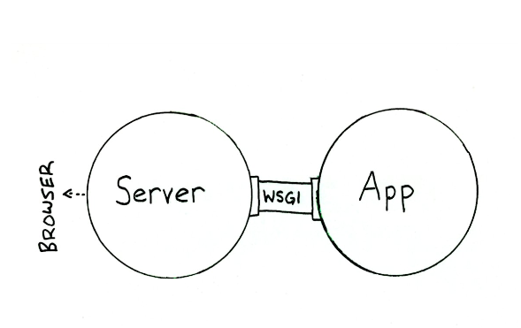

## Connecting Web Apps to Web App Servers

We'd like to run our Django app inside a production quality web server
that can handle high volume traffic.  What server can we use?

Developers using Flask, Pyramid, CherryPy, and other Python web 
frameworks also want this.  
Can we have one app server that can accept all of these apps?

We need a standard interface that specifies:

* what the server will do
* how server and web app communicate with each other
   - server receives HTTP requests. In what format should it give the
     request to the app?
   - app returns a response.  In what format should it give it to server?
* packaging of the app, so we can just "drop it" into the server

Java has standards for JSP and Servlets, Servlet containers, and
the more powerful (and heavy-weight) Java EE servers. 
The standards explicitly define all of these and as a result there
are lots of good, interchangable web servers for Java web apps.
A Java web app packaged as a Web ARchive (WAR)
file can be run by any Servlet container or JavaEE server.

Examples of Servlet containers are *Apache Tomcat* and *Jetty*.

Examples of JavaEE servers are Oracle *Glassfish*, IBM *Web Sphere*,
and Apache *Geronimo*.  Apache Tomcat also has a *TomcatEE* version.

For Python web apps, the standard interface is *Web Server Gateway Interface* 
([WSGI][wsgi-docs]) defined in PEP 3333.  WSGI defines a simple
interface for how a web server and web app communicate with each other.
[AppDynamics][wsgi-appdynamics] has a very good article about WSGI.

Popular WSGI servers are:

* Bjoern
* Gunicorn (Green Unicorn)
* uWSGI (micro-WSGI), typically together with nginx as reverse proxy
* Apache HTTP Server with mod_wsgi
* CherryPy is both a WSGI server and web app framework

[AppDynamics][wsgi-appdynamics] has a [comparison][wsgi-appdynamics] 
and [benchmarks][wsgi-benchmarks].
In their tests, Bjoern was by far the fastest and most light-weight server.

## Deploying Django Apps

To be added.

---

[wsgi-docs]: https://wsgi.readthedocs.io/en/latest/what.html
[wsgi-idyll]: http://ivory.idyll.org/articles/wsgi-intro/what-is-wsgi.html, "Article about WSGI by Idyll.org"
[wsgi-appdynamics]: https://www.appdynamics.com/blog/engineering/an-introduction-to-python-wsgi-servers-part-1/
[wsgi-benchmarks]: https://www.appdynamics.com/blog/engineering/a-performance-analysis-of-python-wsgi-servers-part-2/
